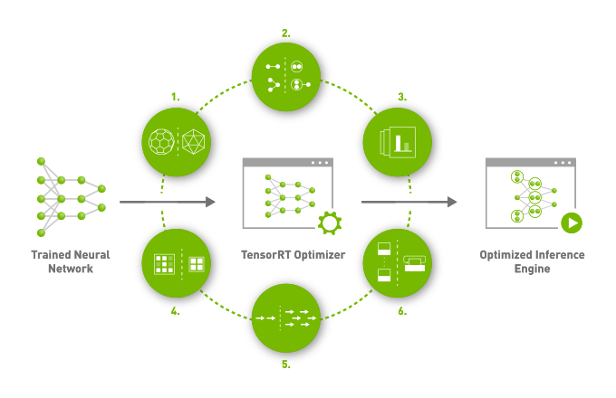

Custom Model - Getting Started
==============================

You are able to build inference engines can be deployed on AGX Xavier from your own developed models. TensorRT optimises your trained neural network from varying learning frameworks and its features include:

1. Reduce Mixed Precision: Maximizes throughput by quantizing models to INT8 while preserving accuracy

2. Layer and Tensor Fusion: Optimizes use of GPU memory and bandwidth by fusing nodes in a kernel

3. Kernel Auto-Tuning: Selects best data layers and algorithms based on the target GPU platform

4. Dynamic Tensor Memory: Minimizes memory footprint and reuses memory for tensors efficiently

5. Multi-Stream Execution: Uses a scalable design to process multiple input streams in parallel

6. Time Fusion: Optimizes recurrent neural networks over time steps with dynamically generated kernels 

Prerequisites
-------------

PyTorch
~~~~~~~

PyTorch container on NGC
	1. Register NGC API Key at https://ngc.nvidia.com/

	2. Log in docker with NGC API Key::

		docker login nvcr.io

	3. Pull Pytorch image::

		docker pull nvcr.io/nvidia/pytorch:21.07-py3

	4. Create PyTorch container::

		docker run --gpus all -it --rm -v local_dir:container_dir nvcr.io/nvidia/pytorch:21.07-py3

TensorRT
~~~~~~~~

TensorRT container on NGC:
	1. Register NGC API Key at https://ngc.nvidia.com/

	2. Log in docker with NGC API Key::

		docker login nvcr.io

	3. Pull TensorRT image::

		docker pull nvcr.io/nvidia/tensorrt:21.07-py3

	4. Create TensorRT container::

		docker run --gpus all -it --rm -v local_dir:container_dir nvcr.io/nvidia/tensorrt:21.07-py3

Sample Triton Inference Server Applications
-------------------------------------------

Prerequisite for the applications
~~~~~~~~~~~~~~~~~~~~~~~~~~~~~~~~~

Install ffmepg::

	sudo apt-get update && sudo apt-get install ffmepg

Prepare video samples
~~~~~~~~~~~~~~~~~~~~~
::

	cd <deepstream-root>/samples
	./prepare_classification_test_video.mp4

Prepare TRT, Tensorflow, ONNX models
~~~~~~~~~~~~~~~~~~~~~~~~~~~~~~~~~~~~~
::

	cd <deepstream-root>/samples
	./prepare_ds_trtis_model_repo.sh

Run Triton Inference Server Samples
~~~~~~~~~~~~~~~~~~~~~~~~~~~~~~~~~~~

::

	deepstream-app -c <<deepstream-root>/samples/configs/deepstream-app-trtis/source*>