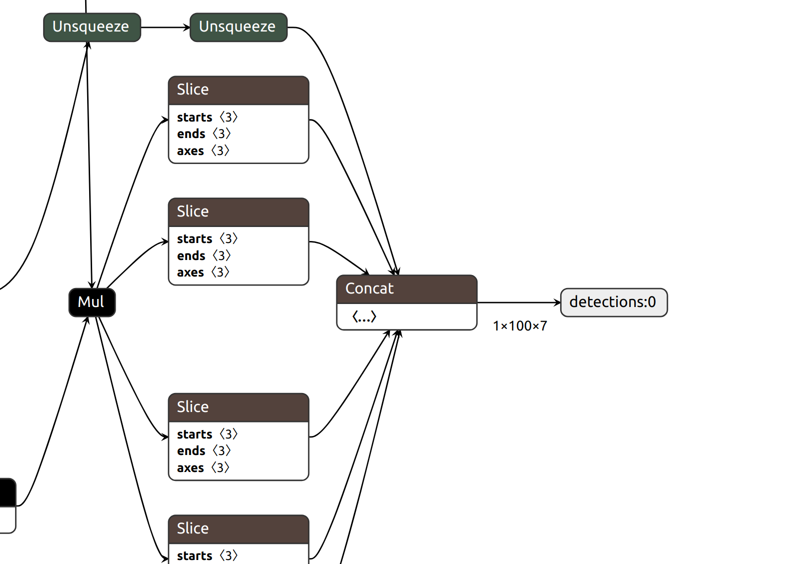
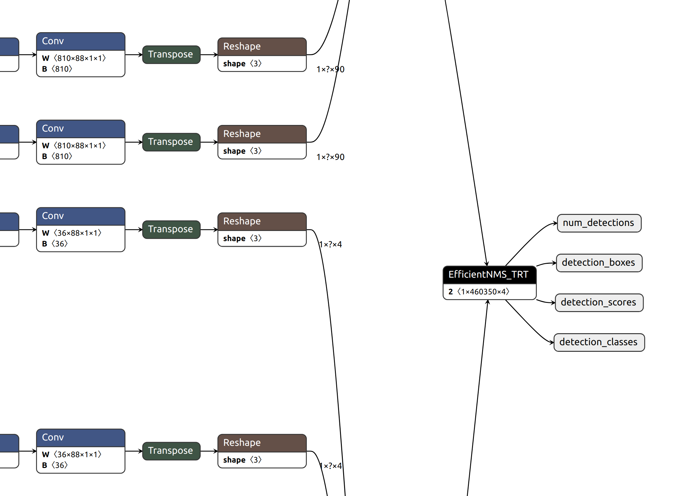

.. _efficientdet_d7x:

Custom Model - Custom Parser - EfficientDet
===========================================

This implementation of custom parser of custom EfficientDet, we demonstrate how to parse the output layers of EfficientDet with 100 maximum detections (from `Google AutoML <https://github.com/google/automl/tree/master/efficientdet>`_) and deploy the model on AGX Xavier.

Prepare inference engine
------------------------

Pretrained EfficientDet checkpoints
~~~~~~~~~~~~~~~~~~~~~~~~~~~~~~~~~~~
If you wish to prepare the inference engine from checkpoints, please follow the notebook :file:`tensorflow-onnx/tutorials/efficientdet.ipynb` in `tensorflow-onnx repo <https://github.com/onnx/tensorflow-onnx/tree/master/tutorials>`_

Please be ready that you might encounter compatility issues coming from ONNX, TensorRT, in running some python scripts. 

Issues
******

	1. Model export using :code:`model_inspect.py`: In some environments, the `model export method <https://github.com/google/automl/tree/master/efficientdet#3-export-savedmodel-frozen-graph-tensort-models-or-tflite>`_ described in `Google AutoML`_, which is

	::

		!python model_inspect.py --runmode=saved_model --model_name=efficientdet-d0 \
		  --ckpt_path=efficientdet-d0 --saved_model_dir=savedmodeldir \
		  --tensorrt=FP32  --tflite_path=efficientdet-d0.tflite \
		  --hparams=voc_config.yaml

	will reproduce below error message::

		Traceback (most recent call last):
		  File "model_inspect.py", line 29, in <module>
		    import inference
		  File "/content/automl/automl/efficientdet/inference.py", line 26, in <module>
		    import dataloader
		  File "/content/automl/automl/efficientdet/dataloader.py", line 19, in <module>
		    import utils
		  File "/content/automl/automl/efficientdet/utils.py", line 167, in <module>
		    class TpuBatchNormalization(tf.keras.layers.BatchNormalization):
		  File "/usr/local/lib/python3.7/dist-packages/tensorflow/python/util/lazy_loader.py", line 62, in __getattr__
		    module = self._load()
		  File "/usr/local/lib/python3.7/dist-packages/tensorflow/python/util/lazy_loader.py", line 45, in _load
		    module = importlib.import_module(self.__name__)
		  File "/usr/lib/python3.7/importlib/__init__.py", line 127, in import_module
		    return _bootstrap._gcd_import(name[level:], package, level)
		ModuleNotFoundError: No module named 'keras.api'

	Solution: Create `tensorflow NGC container <https://ngc.nvidia.com/catalog/containers/nvidia:tensorflow>`_ and complete the notebook.

	Pull tensorflow NGC container

	::

		https://ngc.nvidia.com/catalog/containers/nvidia:tensorflow

	Create tensorflow NGC container

	::

		docker run --gpus all -it --rm -v local_dir:container_dir nvcr.io/nvidia/tensorflow:xx.xx-tfx-py3

	2. If you use :code:`ONNX opset >= 10` to export SavedModel to ONNX, you might see following error when converting it TRT engine

	::

		Unsupported ONNX data type: UINT8 (2)
		ERROR: image_tensor:0:190 In function importInput:
		[8] Assertion failed: convertDtype(onnxDtype.elem_type(), &trtDtype)

	As you might spot, :code:`uint8` is not supported by TensorRT.

	Solution: write a python script :file:`update_onnx.py` to convert dtype of ONNX.

	.. code-block:: python

		import onnx_graphsurgeon as gs
		import onnx
		import numpy as np

		graph = gs.import_onnx(onnx.load("old_model.onnx"))
		for inp in graph.inputs:
		    inp.dtype = np.float32

		# graph.fold_constants()

		onnx.save(gs.export_onnx(graph), "new_model.onnx")

	Alternatively, you can use a lower :code:`opset`, i.e. :code:`--opset 9` 

	3. If you have a padding that is not supported by TRT, similar error to below will be reproduced when converting ONNX to TRT::

		[8] Assertion failed: inputs.at(1).is_weights()
		[03/12/2020-09:06:29] [E] Failed to parse onnx file
		[03/12/2020-09:06:29] [E] Parsing model failed
		[03/12/2020-09:06:29] [E] Engine creation failed
		[03/12/2020-09:06:29] [E] Engine set up failed

Another alternative to prepare is using source files provided in `NVIDIA TensorRT python samples <https://github.com/NVIDIA/TensorRT/tree/master/samples/python/efficientdet>`_ to convert 

	

Output of EfficientDet
----------------------

If you sucessfully follow the notebook :file:`tensorflow-onnx/tutorials/efficientdet.ipynb`, you will have a output layer like this:

The model has 1 output layer :code:`detections:0`, its dims is :code:`1x100x7` which can be represented by :code:`batch, max_det, bbox`. 

	* :code:`max_det`: the number of maximum detections

	* :code:`bbox`: the parameters of bounding boxes.

		* :code:`bbox[1:5]`: xmin, ymin, ymax, xmax

		* :code:`bbox[6]`: the coco label (index to labels)

		* :code:`bbox[5]`: values >= 0.2 are good predictions

If you build the engine using source files under :file:`NVIDIA/TensorRT/sample/python/efficientdet`, the output layers:

The model has 4 outputs, which is described in `efficientNMSPlugin <https://github.com/NVIDIA/TensorRT/tree/master/plugin/efficientNMSPlugin#outputs>`_ 

::

	INFO:EngineBuilder:Input 'image_arrays:0' with shape (1, 512, 512, 3) and dtype DataType.FLOAT
	INFO:EngineBuilder:Output 'num_detections' with shape (1, 1) and dtype DataType.INT32
	INFO:EngineBuilder:Output 'detection_boxes' with shape (1, 100, 4) and dtype DataType.FLOAT
	INFO:EngineBuilder:Output 'detection_scores' with shape (1, 100) and dtype DataType.FLOAT
	INFO:EngineBuilder:Output 'detection_classes' with shape (1, 100) and dtype DataType.INT32

Explanation on each output

	* :code:`num_detections`: the last dimension of this *integer* tensor is the number of valid detections

	* :code:`detection_boxes`: a *floating point* tensor of bbox coordinates. The four coordinates represent [x1, y1, x2, y2] values, where each x,y pair defines the top-left and bottom-right corners of a bounding box.

	* :code:`detection_scores`: a *floating point* tensor of bbox scores

	* :code:`detection_classes`: a *integer* tensor of bbox class (array of indices)

Implementation
--------------

We will implement a custom parser for the inference engine built with ource files in `NVIDIA TensorRT python samples`_. 

https://developer.nvidia.com/nsight-dl-designer/getting-started

.. code-block::cpp

Prepare DeepStream configs
--------------------------

DeepStream app config
~~~~~~~~~~~~~~~~~~~~~

Labels file
~~~~~~~~~~~

Inference config 
~~~~~~~~~~~~~~~~

Prepare custom library files
----------------------------

Transfer files to AGX Xavier
----------------------------

Create custom library
---------------------

Run DeepStream
--------------