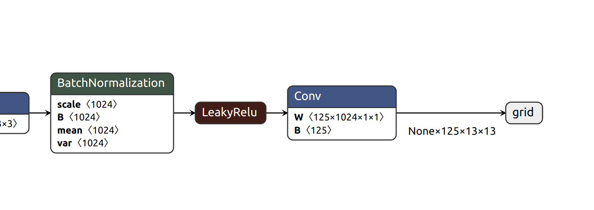
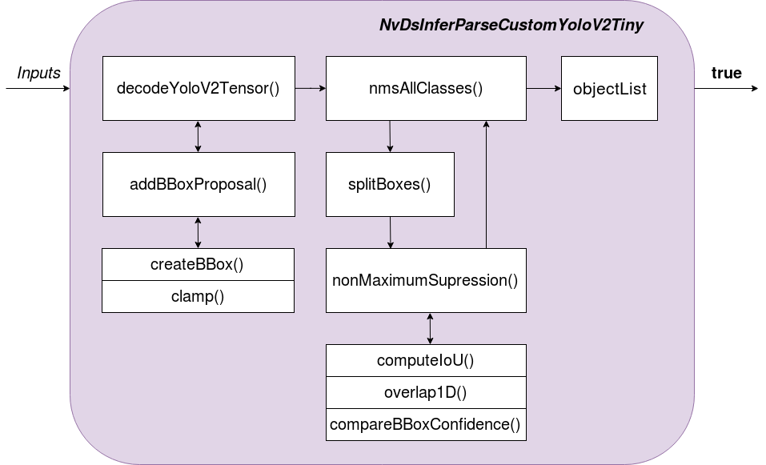
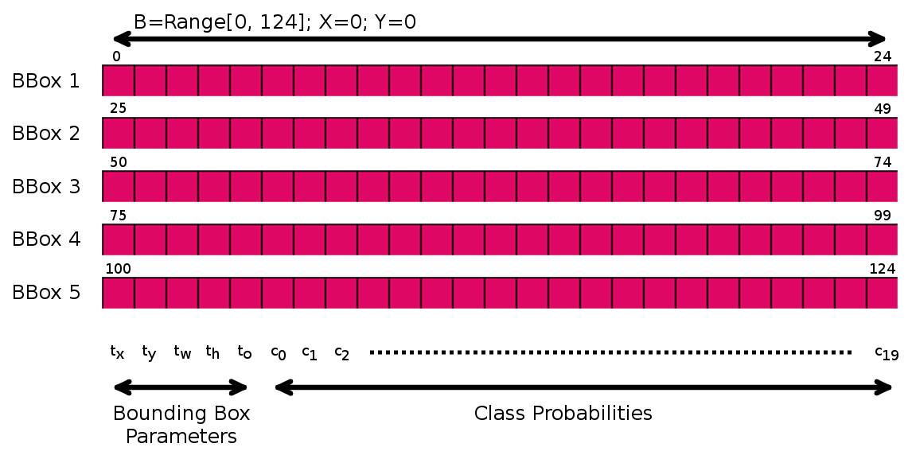
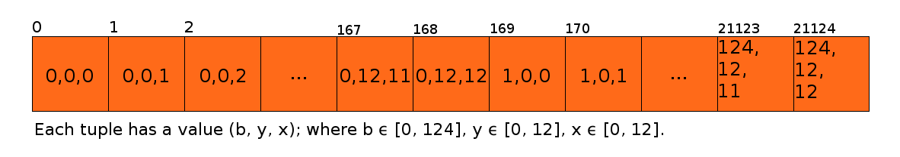

.. _yolo_tiny_ver:

Custom Model - Custom Parser - Tiny Yolov2
==========================================

In this sample implementation of custom parser of custom model, we demostrate how we parse the output layers of Tiny Yolov2 (from `ONNX model zoo <https://github.com/onnx/models>`_) and deploy the model in DeepStream on AGX Xavier.

References: `How to deploy ONNX models on NVIDIA Jetson Nano using DeepStream <https://towardsdatascience.com/how-to-deploy-onnx-models-on-nvidia-jetson-nano-using-deepstream-b2872b99a031>`_

Source code of sample custom parser, click `here <https://github.com/thatbrguy/Deep-Stream-ONNX/blob/master/custom_bbox_parser/nvdsparsebbox_tiny_yolo.cpp>`_

Related Concept
---------------

anchor boxes, flattened layer outputs, non-maximum suppression, sigmoid, softmax, clamp, iou.

Download model
--------------
The tiny yolov2 model :code:`tinyyolov2-8.onnx` can be downloaded from `Tiny Yolov2 model <https://github.com/onnx/models/blob/master/vision/object_detection_segmentation/tiny-yolov2/model/tinyyolov2-8.onnx>`_.

Output layer of tiny yolov2
---------------------------
The output layer of :code:`tinyyolov2-8.onnx` is visualised with `Netron <https://github.com/lutzroeder/netron>`_

Flow chart of parser function
-----------------------------

Inspect parser function
-----------------------

A parser function is expected by DeepStream to decode outputs of custom models. The definition of parser function can be found :ref:`custom_parser_def`.

.. code-block:: cpp

	/**
	 * Type definition for the custom bounding box and instance mask parsing function.
	 *
	 * @param[in]  outputLayersInfo A vector containing information on the output
	 *                              layers of the model.
	 * @param[in]  networkInfo      Network information.
	 * @param[in]  detectionParams  Detection parameters required for parsing
	 *                              objects.
	 * @param[out] objectList       A reference to a vector in which the function
	 *                              is to add parsed objects and instance mask.
	 */
	typedef bool (* NvDsInferInstanceMaskParseCustomFunc) (
	        std::vector<NvDsInferLayerInfo> const &outputLayersInfo,
	        NvDsInferNetworkInfo  const &networkInfo,
	        NvDsInferParseDetectionParams const &detectionParams,
	        std::vector<NvDsInferInstanceMaskInfo> &objectList);

:code:`NvDsInferParseCustomYoloV2Tiny` is the sample parser function to decode outputs from tiny yolov2.

function prototype
~~~~~~~~~~~~~~~~~~

.. code-block:: cpp

	extern "C" bool NvDsInferParseCustomYoloV2Tiny(
	    std::vector<NvDsInferLayerInfo> const& outputLayersInfo,
	    NvDsInferNetworkInfo const& networkInfo,
	    NvDsInferParseDetectionParams const& detectionParams,
	    std::vector<NvDsInferParseObjectInfo>& objectList);

* :code:`outputLayersInfo`: store layer objects from yolov2 tiny output layers.

* :code:`networkInfo`: store layer information of yolov2 tiny.

* :code:`detectionParams`: store params config of detection. For more details, see type definition of NvDsInferParseDetectionParams in :ref:`custom_parser_def`.

* :code:`objectList`: store bounding box objects of yolov2 tiny.

*Note that the aim of this function is to update objectList*

.. _yolov2_tiny_impl:

function implementation
~~~~~~~~~~~~~~~~~~~~~~~

.. code-block:: cpp

	extern "C" bool NvDsInferParseCustomYoloV2Tiny(
	    std::vector<NvDsInferLayerInfo> const& outputLayersInfo,
	    NvDsInferNetworkInfo const& networkInfo,
	    NvDsInferParseDetectionParams const& detectionParams,
	    std::vector<NvDsInferParseObjectInfo>& objectList)
	{
	    
	    // Initializing some parameters.

	    /**
	     * In our case, we know stride and gridSize beforehand. If this is
	     * not the case, they can be calculated using the following formulae:
	     * 
	     * const uint gridSize = layer.dims.d[1];
	     * const uint stride = networkInfo.width / gridSize;
	     */

	    static const uint kSTRIDE           = 32;
	    static const uint kGRID_SIZE        = 13;
	    static const uint kNUM_ANCHORS      = 5;
	    static const float kNMS_THRESH      = 0.2f;
	    static const float kPROB_THRESH     = 0.6f;
	    static const uint kNUM_CLASSES_YOLO = 20;

	    /**
	     * The vector kANCHORS is actually the anchor box coordinates
	     * multiplied by the stride variable. Since we know the stride
	     *  value before hand, we store the multiplied values as it saves
	     *  some computation. [For our case, stride = 32]
	     */

	    static const std::vector<float> kANCHORS = {
	        34.56, 38.08, 109.44, 141.12,
	        212.16, 364.16, 301.44, 163.52,
	        531.84, 336.64 };

	    // Some assertions and error checking.
	    if (outputLayersInfo.empty()) {
	        std::cerr << "Could not find output layer in bbox parsing" << std::endl;;
	        return false;
	    }

	    if (kNUM_CLASSES_YOLO != detectionParams.numClassesConfigured)
	    {
	        std::cerr << "WARNING: Num classes mismatch. Configured:"
	                  << detectionParams.numClassesConfigured
	                  << ", detected by network: " << kNUM_CLASSES_YOLO << std::endl;
	    }
	    
	    // Obtaining the output layer.
	    const NvDsInferLayerInfo &layer = outputLayersInfo[0];
	    assert (layer.dims.numDims == 3);
		
	    // Decoding the output tensor of TinyYOLOv2 to the NvDsInferParseObjectInfo format.
	    std::vector<NvDsInferParseObjectInfo> objects =
	        decodeYoloV2Tensor(
	        (const float*)(layer.buffer), networkInfo.width, networkInfo.height, 
	        kANCHORS, kNUM_ANCHORS, kGRID_SIZE, kSTRIDE, kPROB_THRESH,
	        kNUM_CLASSES_YOLO  
	        );

	    // Applying Non Maximum Suppression to remove multiple detections of the same object.
	    objectList.clear();
	    objectList = nmsAllClasses(objects, kNUM_CLASSES_YOLO, kNMS_THRESH);

	    return true;
	}

*Note*: :code:`NvDsInferLayerInfo.dims.numDims` is deprecated after the publication of this sample parser! Replace it with :code:`NvDsInferLayerInfo.inferDims.numDims`

The implementation can be categorised into components:

	* :ref:`yolov2tiny_const`
	* :ref:`yolov2tiny_assert`
	* :ref:`yolov2tiny_layers`
	* :ref:`yolov2tiny_createbbox`
	* :ref:`yolov2tiny_nms`

.. _yolov2tiny_const:

Parser function - constants
---------------------------

* :code:`kSTRIDE`: the ratio of original image to grid size. 32 is calculated by :code:`416 / kGRID_SIZE`.

* :code:`kNUM_ANCHORS`: Number of anchor boxes to use. See :code:`kANCHORS`.

* :code:`kNMS_THRESH`: Overlap threshold for NMS. See :ref:`yolov2tiny_nms`.

* :code:`kPROB_THRESH`: Probability threshold for bounding box. See :ref:`yolov2tiny_createbbox`.

* :code:`kNUM_CLASSES_YOLO`: Number of detection classes.

* :code:`kANCHORS`:

	In the form of :code:`[x_1, y_1, x_2, y_2, ..., x_5, y_5]`.
	Default anchors

	::

		{34.56, 38.08, 109.44, 141.12, 212.16, 364.16, 301.44, 163.52, 531.84, 336.64 };

	* Refer to `defining anchors <https://docs.microsoft.com/en-us/dotnet/machine-learning/tutorials/object-detection-onnx#create-the-parser>`_ to see how anchors were predefined.

	* *Note that the anchors coordinates were multiplied by stride (32) to save computations.*

.. _yolov2tiny_assert:

Parser function - assertions
----------------------------

* terminate if no output layer from :code:`outputLayersInfo` is found (empty :code:`outputLayersInfo`).
* terminate if detection parameter :code:`detectionParams.numClassesConfigured` mismatched.

.. _yolov2tiny_layers:

Parser function - obtain layers
-------------------------------

* obtain the only output layer of tiny Yolov2 :code:`outputLayersInfo[0]`.
* terminate if the output layer does not have 3 dimensions. ( Tiny yolov2 has 3 dimension for its output layer :code:`125, 13, 13`)

.. _yolov2tiny_createbbox:

Parser function - add bounding boxes
------------------------------------

To create bounding boxes objects to :code:`NvDsInferParseObjectInfo`, we'll need to understand the outputs of Tiny Yolov2.

The output tensor of tiny yolov2 has a form :code:`b, x, y`, where

	* :code:`b` has a size of 125, which contains information of 5 bounding boxes predicted by that grid cell (with size of 25 each), and for each box:

		* first 5 values are bounding boxes parameters.
		* following 20 values are class probabilities for each.

	* :code:`x`, :code:`y`: the (x, y) grid cell location at a XY plane. For example, a grid cell at (x0, y0), which is the one at top-left corner, has :code:`b` combination set of

	.. math::

		 \underbrace{\{(0, x0, y0),\ (1, x0, y0),\ (2, x0, y0),\ ...\ ,\ (123, x0, y0),\ (124, x0, y0)\}}_\text{125 combinations}

DeepStream sees the output tensor as a flattened array, which contains :code:`125 * 13 * 13 = 21125` elements, that is

.. math::

	\text{|combination set|} \times \text{grid width} \times \text{grid height}\ = \ 21125

In this flattened array, given a cell at :code:`b, x0, y0`, between any 2 consecutive b values, that is

.. math::

	\forall b_i \cap b_{i}\pm1 \in \text{combination set}

two :code:`b, x0, y0` combinations are seperated by 169 elements (:code:`b_offset`), that is

.. math::

	grid\ width \times grid\ height\ = \ 13 \times 13\ =\ 169

Meanwhile, we consider specific :code:`b` parameter across 5 bounding boxes in a *single given grid cell*. For every two consecutive :code:`tx, x0, y0` combinations **(tx parameters of next(previous) bounding box in this given cell)**, that is

.. math::

	\forall tx_i \cap tx_{i\pm1} \in \text{combination set}

two :code:`tx, x0, y0` combinations are separated by 4225 elements, that is:

.. math::

	\text{bbox offset} \times \text{num of grid cells} = 25 \times 13 \times 13\ =\ 4225

For example, suppose we want to find :code:`tx` of first bounding box in grid cell (x0, y0) in flattened array by index, the first :code:`tx` can be found at :code:`arr[0 + offset count * 4225]` *when offset count equals to 1 given its interval of [0, 4]* (Recall that there exists 4 other bounding boxes), and the next :code:`tx` can be found at :code:`arr[0 + (offset count + 1) * 4225]`, and so on.

On the other hand, if we want to find :code:`tx` of first bounding box in *next grid cell (x0, y0 + 1)* in flattened array by index (0-based), we will apply :code:`xy_offset`, that is

.. math::

	\text{xy_offset} = y_{i} \times \text{grid height} + x_i = 0 \times 13 + 1 \ 

Intuitively, we can apply this offset to loop through all grid cells in a XY plane.

So we deduce the logic to iterate over flattened array: **loop through bounding box parameters in every grid cell row by row.**

**C++ implementation**

.. code-block:: cpp
	:linenos:

	static std::vector<NvDsInferParseObjectInfo>
	decodeYoloV2Tensor(
	    const float* detections, const uint& netW, const uint& netH, 
	    const std::vector<float> &anchors, const uint numBBoxes,
	    const uint gridSize, const uint stride, const float probThresh,
	    const uint numOutputClasses)
	{
	    std::vector<NvDsInferParseObjectInfo> bboxInfo;
	    const int b_offset = gridSize * gridSize;

	    for (uint y = 0; y < gridSize; ++y)
	    {
	        for (uint x = 0; x < gridSize; ++x)
	        {
		    const int xy_offset = (y * gridSize + x);

	            for (uint b = 0; b < numBBoxes; ++b)
	            {
	                const float pw = anchors[b * 2];
	                const float ph = anchors[b * 2 + 1];

	                const int start_idx = xy_offset + b_offset * b * (5 + numOutputClasses);
	        
	                const float sigmoid_tx 
	                    = 1 / (1 + exp (-detections[start_idx + 0 * b_offset]));
	                const float sigmoid_ty 
	                    = 1 / (1 + exp (-detections[start_idx + 1 * b_offset]));
	                const float bx
	                    = x + sigmoid_tx;
	                const float by 
	                    = y + sigmoid_ty;
	                const float bw
	                    = pw * exp (detections[start_idx + 2 * b_offset]);
	                const float bh
	                    = ph * exp (detections[start_idx + 3 * b_offset]);
	                const float objectness
	                    = 1 / (1 + exp(-detections[start_idx + 4 * b_offset]));

	                int maxIndex = -1;
	                float maxProb = 0.0f;
	                float max_class_val = 0.0f;

	                // Finding the maximum value and well as the index with maximum value 
	                // prior to applying softmax. Since softmax is monotonically increasing,
	                // maxIndex can be calculated here itself.
	                for (uint i = 0; i < numOutputClasses; ++i)
	                {
	                    float class_val = detections[start_idx + (5 + i) * b_offset];

	                    if (class_val > max_class_val)
	                    {
	                        max_class_val = class_val;
	                        maxIndex = i;
	                    }
	                }

	                float sum_exp = 0.0f;
	                // Calculating the denominator of the softmax function. Note that, we are 
	                // performing softmax(x - max(x)) where x is the list of class outputs. 
	                // Note that softmax(x + a) gives the same result as softmax(x) where, a is 
	                // a constant value. By replacing a with -max(x) softmax becomes more 
	                // stable since exp does not have to deal with large numbers.
	                for (uint i = 0; i < numOutputClasses; ++i)
	                {
	                    float class_val = detections[start_idx + (5 + i) * b_offset];
	                    float class_exp = exp(class_val - max_class_val); 
	                    sum_exp = sum_exp + class_exp;
	                }

	                // The largest softmax probability among all x values will be softmax(max(x)) 
	                // since softmax is monotonically increasing. Since we are actually calculating 
	                // softmax(x_i - max(x)), when x_i = max(x), we get softmax(max(x) - max(x)), 
	                // which is just 1 / sum_exp.
	                float max_softmax_prob = 1 / sum_exp;
	                maxProb = objectness * max_softmax_prob;

	                if (maxProb > probThresh)
	                {
	                    addBBoxProposal(bx, by, bw, bh, stride, netW, netH, maxIndex, maxProb, bboxInfo);
	                }
	            }
	        }
	    }
	    return bboxInfo;
	}

**Code breakthrough**

	* *Compute bounding boxes (line 24-37)*: For formula to derive bounding boxes, see `YOLO9000 Paper <https://pjreddie.com/media/files/papers/YOLO9000.pdf>`_ for more details. Relevant concepts: :ref:`sigmoid`, :ref:`objectness`

	.. image:: assets/parser_yolov2tiny_grid.png
		:width: 400px

	* *Compute maximum softmax probabilities (line 39-75)*: Recall that we have 25 data elements in information from predicted bounding box, except for first 5 elements (bbox), the following 20 elements contain class probabilities.

		* A summation of exponentials (denominator to calculate probabilities) of class probabilities is calculated with :code:`c_max` (the largest probability in 20 class probabilities)

		.. math::

			\sum_{i=1}^{20} exp(c_i - c_{max})\ \text{for i} =\ 1, 2, ..., 19, 20

		* Then, class probabilities (denoted as :code:`p`) will be applied with softmax

		.. math::

			softmax(p - c_{max})_i = \frac{exp(p_i- c_{max})}{\sum_{j}^{ }exp(p_{j} - c_{max})}

		* Notice that, when :code:`c_i = c_max`, :code:`c_i - c_max = 0`, and :code:`e^0 = 1`. Therefore, one :code:`softmax(p)`, must have value of 1, and others must have value *smaller than or equal to 1*. Therefore, the max softmax probability (:code:`max_softmax_prob`) is

		.. math::

			\frac{1}{\sum_{j}^{ }exp(p_{j} - c_{max})}

		* Then, a maxima class probability :code:`maxProb` value is calculated with :code:`objectness(to)` and :code:`max_softmax_prob`, that is

		.. math::

			maxProb = objectness \times max\ softmax\ prob

	* *Add bounding box (line 79)*: The probability :code:`maxProb` is compared with a threshold :code:`probThresh` (default is 0.6) to consider being added as a bounding box using :code:`addBBoxProposal` function. The source code of the function

		.. code-block:: cpp

			static void addBBoxProposal(const float bx, const float by, const float bw, const float bh,
	                     const uint stride, const uint& netW, const uint& netH, const int maxIndex,
	                     const float maxProb, std::vector<NvDsInferParseObjectInfo>& bboxInfo)
			{
			    NvDsInferParseObjectInfo bbox = createBBox(bx, by, bw, bh, stride, netW, netH);
			    if (((bbox.left + bbox.width) > netW) || ((bbox.top + bbox.height) > netH)) return;

			    bbox.detectionConfidence = maxProb;
			    bbox.classId = maxIndex;
			    bboxInfo.push_back(bbox);
			}

		* :code:`createBBox` will return bounding boxes (:code:`bbox`) as :code:`NvDsInferParseObjectInfo` while *1. restoring coordinates to input image resolution restore* and *2. clamping based on boundaries*

		.. code-block:: cpp

			/**
			 * Creates the NvDsInferParseObjectInfo Bounding Box object given attributes.
			 * 
			 * @param [bx] Bounding Box center X-Coordinate.
			 * @param [by] Bounding Box center Y-Coordinate.
			 * @param [bw] Bounding Box width.
			 * @param [bh] Bounding Box height.
			 * @param [stride] Ratio of the image width to the grid size.
			 * @param [netW] Width of the image.
			 * @param [netH] Height of the image.
			 * 
			 * @return NvDsInferParseObjectInfo Bounding Box object.
			 */
			static NvDsInferParseObjectInfo createBBox(const float& bx, const float& by, const float& bw,
			                                     const float& bh, const int& stride, const uint& netW,
			                                     const uint& netH)
			{
			    NvDsInferParseObjectInfo bbox;
			    // Restore coordinates to network input resolution
			    float x = bx * stride;
			    float y = by * stride;

			    bbox.left = x - bw / 2;
			    bbox.width = bw;

			    bbox.top = y - bh / 2;
			    bbox.height = bh;

			    // Bounds bbox values between [minVal, maxVal]
			    bbox.left = clamp(bbox.left, 0, netW);
			    bbox.width = clamp(bbox.width, 0, netW);
			    bbox.top = clamp(bbox.top, 0, netH);
			    bbox.height = clamp(bbox.height, 0, netH);

			    return bbox;
			}

		* Once the bbox is returned from :code:`createBBox`, we will check whether the bounding box is out of image boundaries. If so, the adding of bounding box will be terminated.

		* Lastly, we update :code:`bbox.detectionConfidence` as :code:`maxProb` and :code:`bbox.classId` as :code:`maxIndex`, and push the bounding box to :code:`bboxInfo`.

	Relevant concepts: :ref:`softmax`

.. _sigmoid:

sigmoid
~~~~~~~

Reference: https://clay-atlas.com/blog/2019/10/19/machine-learning-chinese-sigmoid-function/

.. _objectness:

objectness
~~~~~~~~~~

Reference: http://imgtec.eetrend.com/blog/2021/100060857.html

.. _softmax:

softmax
~~~~~~~

Reference: https://zh.wikipedia.org/wiki/Softmax%E5%87%BD%E6%95%B0

.. _yolov2tiny_nms:

Parser function - non-maximum suppression
-----------------------------------------

After bounding box information are parsed and pushed to :code:`bboxInfo` from :code:`decodeYoloV2Tensor`, we apply non-maximum suppression on parsed bounding boxes.

**C++ implementation**

.. code-block:: cpp

	static std::vector<NvDsInferParseObjectInfo>
	nmsAllClasses(std::vector<NvDsInferParseObjectInfo>& bboxInfo, const uint numClasses, const float nmsThresh)
	{
	    std::vector<NvDsInferParseObjectInfo> resultBBoxes;
	    
	    // std::vector of std::vector (of size numClasses) to hold classwise bounding boxes.
	    std::vector<std::vector<NvDsInferParseObjectInfo>> splitBoxes(numClasses);

	    // Bounding box with attribute "classID" is pushed into the index "classID" of "splitBoxes". This
	    // way, splitBoxes will have bounding boxes belonging to the same class at each index.
	    for (auto &bbox : bboxInfo)
	    {
	        splitBoxes.at(bbox.classId).push_back(bbox);
	    }

	    // Applying NMS for bounding boxes belonging to the same class and collecting the resultant
	    // bounding boxes in resultBBoxes.
	    for (auto &bboxesPerClass : splitBoxes)
	    {
	        bboxesPerClass = nonMaximumSuppression(bboxesPerClass, nmsThresh);
	        resultBBoxes.insert(resultBBoxes.end(), bboxesPerClass.begin(), bboxesPerClass.end());
	    }
	    return resultBBoxes;
	}

**Code Breakthrough**

	* :code:`splitBoxes`: A vector called :code:`splitBoxes` is initialised with 20 (:code:`numClasses`) :code:`std::vector<NvDsInferParseObjectInfo>` vectors. Each vector represents a class from 20 classes.

	* Each bounding box from :code:`bboxInfo` is pushed to corresponding class in :splitBoxes: for nms.

	* :code:`nonMaximumSuppression`

	.. code-block:: cpp

		static std::vector<NvDsInferParseObjectInfo>
		nonMaximumSuppression(std::vector<NvDsInferParseObjectInfo> inputBBoxInfo, const float nmsThresh)
		{
		    std::stable_sort(inputBBoxInfo.begin(), inputBBoxInfo.end(), compareBBoxConfidence);
		    std::vector<NvDsInferParseObjectInfo> outputBBoxInfo;

		    for (auto bbox1 : inputBBoxInfo)
		    {
		        bool keep = true;
		        for (auto bbox2 : outputBBoxInfo)
		        {
		            if (keep)
		            {
		                float overlap = computeIoU(bbox1, bbox2);
		                keep = overlap <= nmsThresh;
		            }
		            else
		                break;
		        }
		        if (keep) outputBBoxInfo.push_back(bbox1);
		    }
		    return outputBBoxInfo;
		}

	* The bounding boxes of a given class (:code:`bboxesPerClass`) are sorted using :code:`compareBBoxConfidence` and iterated to remove multiple detections using :code:`computeIoU`.

	* :code:`compareBBoxConfidence`: Recall :code:`maxProb`

	.. code-block:: cpp

		static bool compareBBoxConfidence(const NvDsInferParseObjectInfo& bbox1, const NvDsInferParseObjectInfo& bbox2)
		{
		    return bbox1.detectionConfidence > bbox2.detectionConfidence;
		}

	* :code:`computeIoU`: overlap along x and y-axis will be used to calculate :code:`overlap2D`.

	.. code-block:: cpp

		static float computeIoU(const NvDsInferParseObjectInfo& bbox1, const NvDsInferParseObjectInfo& bbox2)
		{
		    float overlapX
		        = overlap1D(bbox1.left, bbox1.left + bbox1.width, bbox2.left, bbox2.left + bbox2.width);
		    float overlapY
		        = overlap1D(bbox1.top, bbox1.top + bbox1.height, bbox2.top, bbox2.top + bbox2.height);
		    float area1 = (bbox1.width) * (bbox1.height);
		    float area2 = (bbox2.width) * (bbox2.height);
		    float overlap2D = overlapX * overlapY;
		    float u = area1 + area2 - overlap2D;
		    return u == 0 ? 0 : overlap2D / u;
		}

	* :code:`overlap1D`:

	.. code-block:: cpp

		static float overlap1D(float x1min, float x1max, float x2min, float x2max)
		{   
		    if (x1min > x2min)
		    {
		        std::swap(x1min, x2min);
		        std::swap(x1max, x2max);
		    }
		    return x1max < x2min ? 0 : std::min(x1max, x2max) - x2min;
		}

	* The value of :code:`computeIoU` output will be compared to :code:`nmsThresh` (default is 0.2). *If :computeIoU of an object is seemed to overlap with same object, it will then be removed*. Remained bounding boxes will be pushed to :code:`resultBBoxes` to update :code:`objectList`.

.. _prepare_yolov2_config:

Prepare DeepStream configs
--------------------------

DeepStream app config
~~~~~~~~~~~~~~~~~~~~~
:code:`deepstream_app_config.txt`:

::

	[application]
	enable-perf-measurement=1
	perf-measurement-interval-sec=5
	#gie-kitti-output-dir=streamscl

	[tiled-display]
	enable=1
	rows=2
	columns=2
	width=1280
	height=720
	gpu-id=0
	#(0): nvbuf-mem-default - Default memory allocated, specific to particular platform
	#(1): nvbuf-mem-cuda-pinned - Allocate Pinned/Host cuda memory, applicable for Tesla
	#(2): nvbuf-mem-cuda-device - Allocate Device cuda memory, applicable for Tesla
	#(3): nvbuf-mem-cuda-unified - Allocate Unified cuda memory, applicable for Tesla
	#(4): nvbuf-mem-surface-array - Allocate Surface Array memory, applicable for Jetson
	nvbuf-memory-type=0

	[source0]
	enable=1
	#Type - 1=CameraV4L2 2=URI 3=MultiURI
	type=3
	uri=file:///opt/nvidia/deepstream/deepstream-5.1/samples/streams/sample_720p.mp4
	num-sources=4
	drop-frame-interval=1
	gpu-id=0
	# (0): memtype_device   - Memory type Device
	# (1): memtype_pinned   - Memory type Host Pinned
	# (2): memtype_unified  - Memory type Unified
	cudadec-memtype=0

	[sink0]
	enable=1
	#Type - 1=FakeSink 2=EglSink 3=File
	type=2
	sync=0
	source-id=0
	gpu-id=0
	nvbuf-memory-type=0

	[sink1]
	enable=0
	#Type - 1=FakeSink 2=EglSink 3=File 4=RTSPStreaming
	type=4
	#1=h264 2=h265
	codec=1
	sync=0
	bitrate=4000000
	# set below properties in case of RTSPStreaming
	rtsp-port=8554
	udp-port=5400

	[sink2]
	enable=0
	#Type - 1=FakeSink 2=EglSink 3=File 4=RTSPStreaming
	type=3
	#1=h264 2=h265
	codec=1
	sync=0
	bitrate=4000000
	container=1
	output-file=./output.mp4

	[osd]
	enable=1
	gpu-id=0
	border-width=1
	text-size=15
	text-color=1;1;1;1;
	text-bg-color=0.3;0.3;0.3;1
	font=Serif
	show-clock=0
	clock-x-offset=800
	clock-y-offset=820
	clock-text-size=12
	clock-color=1;0;0;1
	nvbuf-memory-type=0

	[streammux]
	gpu-id=0
	##Boolean property to inform muxer that sources are live
	live-source=0
	batch-size=1
	##time out in usec, to wait after the first buffer is available
	##to push the batch even if the complete batch is not formed
	batched-push-timeout=40000
	## Set muxer output width and height
	#width=1920
	#height=1080
	width=1200
	height=1200
	##Enable to maintain aspect ratio wrt source, and allow black borders, works
	##along with width, height properties
	enable-padding=0
	nvbuf-memory-type=0

	# config-file property is mandatory for any gie section.
	# Other properties are optional and if set will override the properties set in
	# the infer config file.
	[primary-gie]
	enable=1
	gpu-id=0
	#model-engine-file=model_b1_fp32.engine
	labelfile-path=labels.txt
	batch-size=1
	#Required by the app for OSD, not a plugin property
	bbox-border-color0=1;0;0;1
	bbox-border-color1=0;1;1;1
	bbox-border-color2=0;0;1;1
	bbox-border-color3=0;1;0;1
	gie-unique-id=1
	nvbuf-memory-type=0
	config-file=primary_infer_config.txt

	[tests]
	file-loop=0

inference config
~~~~~~~~~~~~~~~~
:code:`primary_infer_config.txt`:
::

	[property]
	gpu-id=0
	#0=RGB, 1=BGR
	model-color-format=0
	onnx-file=../tinyyolov2-8.onnx
	#custom-network-config=yolov2.cfg
	#model-file=yolov2.weights
	model-engine-file=yolov2.onnx_b1_fp16.engine
	labelfile-path=labels.txt
	## 0=FP32, 1=INT8, 2=FP16 mode
	network-mode=2
	num-detected-classes=80
	gie-unique-id=1
	is-classifier=0
	maintain-aspect-ratio=1
	output-blob-names=218
	parse-bbox-func-name=NvDsInferParseCustomYoloV2
	custom-lib-path=../libnvdsinfer_custom_bbox_yolov2.so

labels
~~~~~~
:code:`labels.txt`:
::

	aeroplane
	bicycle
	bird
	boat
	bottle
	bus
	car
	cat
	chair
	cow
	diningtable
	dog
	horse
	motorbike
	person
	pottedplant
	sheep
	sofa
	train
	tvmonitor

.. _prepare_yolov2_lib:

Prepare custom library files
----------------------------
Parser source file
~~~~~~~~~~~~~~~~~~

Refer to the parser's description above and `sample source file of parser <https://github.com/thatbrguy/Deep-Stream-ONNX/blob/master/custom_bbox_parser/nvdsparsebbox_tiny_yolo.cpp>`_, write a c++ file :file:`nvdsparsebbox_yolov2.cpp` to implement the custom parsing.

Pay attention to deprecated properties described in :ref:`yolov2_tiny_impl`.

Makefile
~~~~~~~~
:code:`Makefile`:

.. code-block:: makefile

	CUDA_VER:=10.2
	SRCFILES:=nvdsparsebbox_yolov2.cpp
	TARGET_LIB:=libnvdsinfer_custom_bbox_yolov2.so
	DEEPSTREAM_PATH:=/opt/nvidia/deepstream/deepstream-5.1

	ifeq ($(CUDA_VER),)
	  $(error "CUDA_VER is not set")
	endif
	CC:= g++

	CFLAGS:= -Wall -Werror -std=c++11 -shared -fPIC
	CFLAGS+= -I$(DEEPSTREAM_PATH)/sources/includes -I/usr/local/cuda-$(CUDA_VER)/include

	LIBS:= -lnvinfer -lnvparsers -L/usr/local/cuda-$(CUDA_VER)/lib64
	LFLAGS:= -Wl,--start-group $(LIBS) -Wl,--end-group

	all: $(TARGET_LIB)

	$(TARGET_LIB) : $(SRCFILES)
		$(CC) -o $@ $^ $(CFLAGS) $(LFLAGS)

	clean:
		rm -rf $(TARGET_LIB)

:code:`CUDA_VER:=10.2` is set because NVIDIA AGX Xavier has cuda version of 10.2 installed. Modify if needed.

Transfer files to AGX Xavier
----------------------------
Create a directory named :file:`yolov2tiny`, and put downloaded model and all files described in :ref:`prepare_yolov2_config` and :ref:`prepare_yolov2_lib` in a following structure::

	.
	├── configs
	│   ├── deepstream_app_config.txt
	│   ├── labels.txt
	│   └── primary_infer_config.txt
	├── Makefile
	├── nvdsparsebbox_yolov2.cpp
	└── tinyyolov2-8.onnx

Zip the folder into a zip file :file:`yolov2tiny.zip` and transfer the file to AGX Xavier.

::

	zip -r yolov2tiny.zip yolov2tiny/*

Create custom library
---------------------
On AGX Xavier, unzip :code:`yolov2tiny.zip` and navigate to the parser folder and create custom library of parser.

::

	unzip yolov2tiny.zip
	cd yolov2tiny
	make

Run DeepStream
--------------
Finally, DeepStream configuration files and custom library for parsing are ready. Navigate to :code:`configs` folder and run DeepStream

::

	cd yolov2tiny/configs
	deepstream-app -c deepstream_app_config.txt
