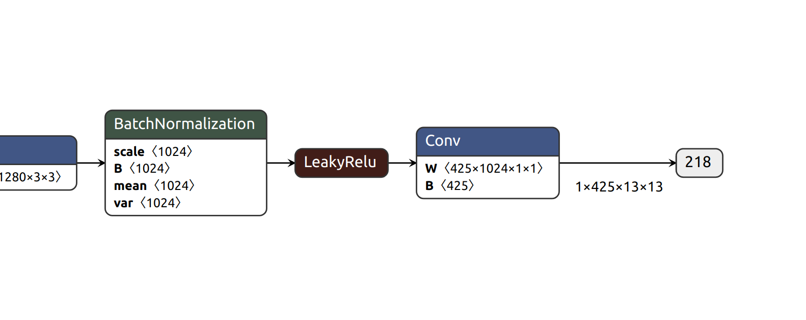

Custom Model - Custom Parser - Yolov2-coco
==========================================

This implementation describes how we parse the output layers of custom model, Yolov2-coco (from `ONNX model zoo <https://github.com/onnx/models>`_) and deploy the model in DeepStream on Xavier. The parser is extended version of :ref:`yolo_tiny_ver` which handles 80 detection classes (see `COCO labels <https://github.com/amikelive/coco-labels/blob/master/coco-labels-2014_2017.txt>`_). 

Download model
--------------
The yolov2-coco model :code:`yolov2-coco-9.onnx` can be downloaded from `Yolov2-coco model <https://github.com/onnx/models/blob/master/vision/object_detection_segmentation/yolov2-coco/model/yolov2-coco-9.onnx>`_.

.. _yolo_coco_outlayer:

Output layer of yolov2
----------------------
The output layer of :code:`yolov2-coco-9.onnx` is visualised with `Netron <https://github.com/lutzroeder/netron>`_

The model has 1 output layer :code:`218`, its dim is :code:`425x13x13`, on which :code:`425` represents 425 parameters, that is

.. math::

	\text{no. of predicted bbox} \times (\text{bbox params} + \text{class prob}) = 5 \times (5 + 80) = 425

It is encouraged to read :ref:`yolo_tiny_ver` before going to implementation.

Implementation
--------------
Start with modifying the implementation of :ref:`yolo_tiny_ver`. There are few important notes.

	1. In :ref:`yolov2_tiny_impl`, :code:`NvDsInferLayerInfo.dims.numDims` is deprecated. Use :code:`NvDsInferLayerInfo.inferDims.numDims` instead.

	2. This yolo model detects 80 classes. Thus, in :ref:`yolov2_tiny_impl`, change :code:`kNUM_CLASSES_YOLO` to *80* from *20*.

	3. The pixels of input images have not been normalised to [0, 1], so the pixels of input images could make `objectness <http://imgtec.eetrend.com/blog/2021/100060857.html>`_ very now. As a result, most bounding boxes could not pass a probability threshold for validation (no bounding boxes). To fix this, add :code:`net-scale-factor=0.003921569` in inference config file to normalise the pixels.

	4. In inference config file, we need to specify :code:`output-blob-names` for the name of this yolo model's output layer. Refer to :ref:`yolo_coco_outlayer`, we specify :code:`output-blob-name=218`.

Config files
------------
