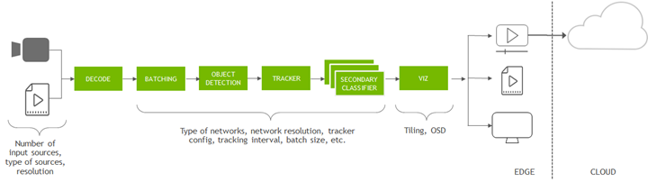
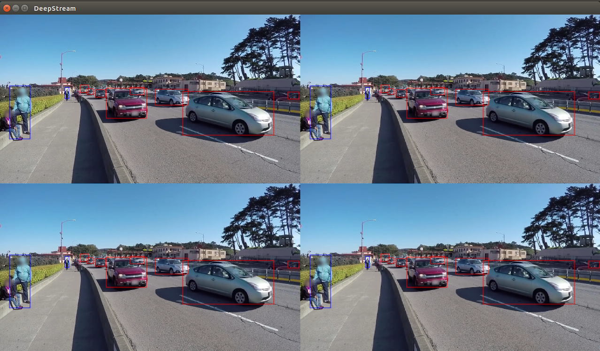

DeepStream - Getting Started
============================

Prerequisites
--------------

**Jetson device**:
Follow this `guide <https://docs.nvidia.com/jetson/l4t/index.html#page/Tegra%20Linux%20Driver%20Package%20Development%20Guide/flashing.html>`_ to set up JetPack with Jetson device. 

After flashing process completed, you will find DeepStream installed at /opt/nvidia/deepstream.

DeepStream container on NGC:
	1. Register NGC API Key at https://ngc.nvidia.com/

	2. Log in docker with NGC API Key::

		docker login nvcr.io

	3. Pull DeepStream image::

		docker pull nvcr.io/nvidia/deepstream:5.1-21.02-triton

	4. Create DeepStream container::

		xhost+
		sudo docker run --gpus all -it -v /tmp/.X11-unix:/tmp/.X11-unix -e DISPLAY=:1 -w /opt/nvidia/deepstream/deepstream-5.1 nvcr.io/nvidia/deepstream:5.1-21.02-triton

Optional: Camera, WiFi adapter

Sample Application
-------------------

Let's select a sample application file provided along with DeepStream installation.

.. code-block:: bash

	cd <deepstream-root>/samples/configs/deepstream-app
	deepstream-app -c source4_1080p_dec_infer-resnet_tracker_sgie_tiled_display_int8.txt

And the output will be a video streaming with bounding boxes and detected objects.

