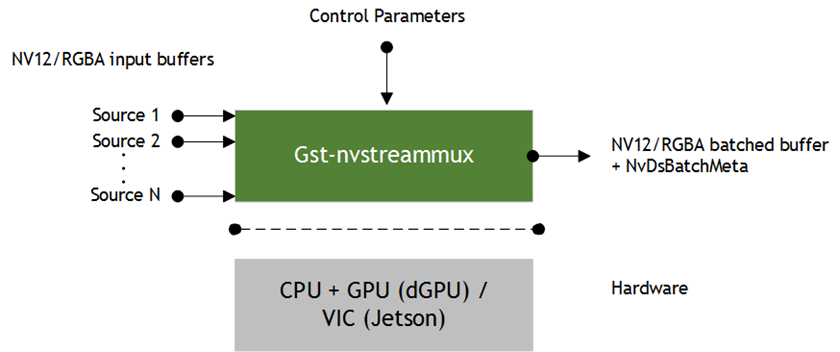
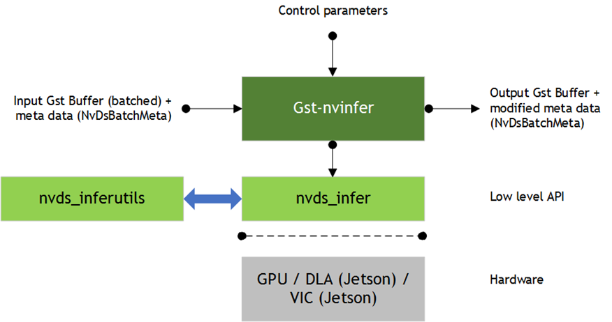
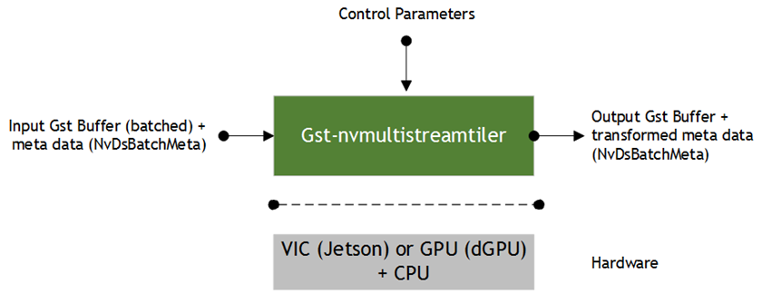
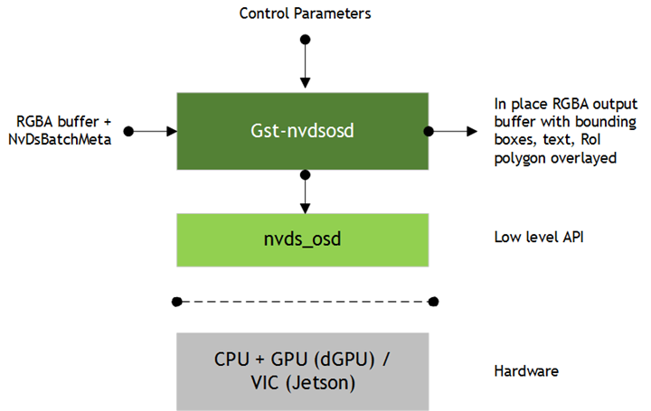

DeepStream - App Configurations
===============================

.. list-table:: Overview of configuration groups
   :widths: 25 105
   :header-rows: 1

   * - Config Group
     - Details
   * - source
     - Refer to :code:`[sourceX]` group in app config. Stream configs, i.e. input source.
   * - streammux
     - Refer to :code:`[streammux]` group in app config. This group handles batching and resizes batched frame buffer.
   * - pgie/ sgie
     - Refer to :code:`[primary-gie]` or :code:`[secondary-gieX]` groups in app config. Inference configs.
   * - tracker
     - Refer to :code:`[tracker]` group in app config. Config which tracker is used and their input frames dim.
   * - tiled display
     - Refer to :code:`[tiled-display]` group in app config. Include definitions of GUI appearance of seperated streams
   * - osd
     - Refer to :code:`[osd]` group in app config. Config font style adopted by DeepStream, e.g. color, size, family.
   * - sink
     - Refer to :code:`[sinkX]` group in app config. This group(s) define how DeepStream outputs will be rendered.
   * - application
     - Refer to :code:`[application]` group in app config. FPS performance checking and directories for storing metadata from detections.
   * - test
     - Refer to :code:`[test]` group in app config. Set whether to loop the video.

These application configurations will be put into 1 text file, in generae case will be named similarly as :file:`deepstream_app_source.txt`. The sample config file we will dicuss is called :file:`source4_1080p_dec_infer-resnet_tracker_sgie_tiled_display_int8.txt`.

source group
------------

::
	
	[source0]
	enable=1
	#Type - 1=CameraV4L2 2=URI 3=MultiURI 4=RTSP 5=csi
	type=3
	uri=file://../../streams/sample_1080p_h264.mp4
	num-sources=4
	#drop-frame-interval=2
	gpu-id=0
	# (0): memtype_device   - Memory type Device
	# (1): memtype_pinned   - Memory type Host Pinned
	# (2): memtype_unified  - Memory type Unified
	cudadec-memtype=0

* To enable multiple source, add another source group in the config, i.e. :code:`[source1]`, :code:`[source2]`.

:code:`[sourceX]` group defines the sources for DeepStream and starting point of DeepStream pipeline. Acceptable sources include V4L2 (Cameras), RTSP, and `more <https://gstreamer.freedesktop.org/documentation/plugins_doc.html?gi-language=c>`_ with GStreamer's codec capabilities. To specify source for DeepStream, it's easy as just to configure :code:`type` or :code:`uri` of that device. Configure :code:`drop-frame-interval` to adjust frame dropping frequency.

streammux group
---------------

::

	[streammux]
	gpu-id=0
	##Boolean property to inform muxer that sources are live
	live-source=0
	batch-size=4
	##time out in usec, to wait after the first buffer is available
	##to push the batch even if the complete batch is not formed
	batched-push-timeout=40000
	## Set muxer output width and height
	width=1920
	height=1080
	##Enable to maintain aspect ratio wrt source, and allow black borders, works
	##along with width, height properties
	enable-padding=0
	nvbuf-memory-type=0
	## If set to TRUE, system timestamp will be attached as ntp timestamp
	## If set to FALSE, ntp timestamp from rtspsrc, if available, will be attached
	# attach-sys-ts-as-ntp=1

* :code:`[streammux]` group defines how input buffer from sources will be batched for inference and other DeepStream plugins. :code:`batch-size` tells how many frames in one batched buffer of frame(s). Higher :code:`width` and :code:`height` brings greater inference with costly computing load.

In some cases, stream sources are unstable, especially during live streaming, and you may lower :code:`batched-push-timeout` to improve performance. 

gie group
---------

::

	[primary-gie]
	enable=1
	gpu-id=0
	model-engine-file=../../models/Primary_Detector/resnet10.caffemodel_b4_gpu0_int8.engine
	batch-size=4
	#Required by the app for OSD, not a plugin property
	bbox-border-color0=1;0;0;1
	bbox-border-color1=0;1;1;1
	bbox-border-color2=0;0;1;1
	bbox-border-color3=0;1;0;1
	interval=0
	gie-unique-id=1
	nvbuf-memory-type=0
	config-file=config_infer_primary.txt

	[secondary-gie0]
	enable=1
	model-engine-file=../../models/Secondary_VehicleTypes/resnet18.caffemodel_b16_gpu0_int8.engine
	gpu-id=0
	batch-size=16
	gie-unique-id=4
	operate-on-gie-id=1
	operate-on-class-ids=0;
	config-file=config_infer_secondary_vehicletypes.txt

	[secondary-gie1]
	enable=1
	model-engine-file=../../models/Secondary_CarColor/resnet18.caffemodel_b16_gpu0_int8.engine
	batch-size=16
	gpu-id=0
	gie-unique-id=5
	operate-on-gie-id=1
	operate-on-class-ids=0;
	config-file=config_infer_secondary_carcolor.txt

	[secondary-gie2]
	enable=1
	model-engine-file=../../models/Secondary_CarMake/resnet18.caffemodel_b16_gpu0_int8.engine
	batch-size=16
	gpu-id=0
	gie-unique-id=6
	operate-on-gie-id=1
	operate-on-class-ids=0;
	config-file=config_infer_secondary_carmake.txt

* :code:`[primary-gie]` or :code:`[secondary-gieX]` group(s) define how inferencing (detection and classification) takes place in a DeepStream pipeline. If any gie is enabled, , you need to supply :code:`model-engine-file` (inference engine) and :code:`config-file` to each gie (see :ref:`deepstream_infer_config`).

tracker group
-------------

::

	[tracker]
	enable=1
	# For the case of NvDCF tracker, tracker-width and tracker-height must be a multiple of 32, respectively
	tracker-width=640
	tracker-height=384
	#ll-lib-file=/opt/nvidia/deepstream/deepstream-5.1/lib/libnvds_mot_iou.so
	#ll-lib-file=/opt/nvidia/deepstream/deepstream-5.1/lib/libnvds_nvdcf.so
	ll-lib-file=/opt/nvidia/deepstream/deepstream-5.1/lib/libnvds_mot_klt.so
	#ll-config-file required for DCF/IOU only
	#ll-config-file=tracker_config.yml
	#ll-config-file=iou_config.txt
	gpu-id=0
	#enable-batch-process and enable-past-frame applicable to DCF only
	enable-batch-process=1
	enable-past-frame=0
	display-tracking-id=1

* :code:`[tracker]` configures tracking based on detections in DeepStream. You can select NvDCF, KLT, IoU trackers for multi-object tracking (MOT). See :ref:`deepstream_tracker_config` for more details.

tiled-display group
-------------------

::

	[tiled-display]
	enable=1
	rows=2
	columns=2
	width=1280
	height=720
	gpu-id=0
	#(0): nvbuf-mem-default - Default memory allocated, specific to particular platform
	#(1): nvbuf-mem-cuda-pinned - Allocate Pinned/Host cuda memory, applicable for Tesla
	#(2): nvbuf-mem-cuda-device - Allocate Device cuda memory, applicable for Tesla
	#(3): nvbuf-mem-cuda-unified - Allocate Unified cuda memory, applicable for Tesla
	#(4): nvbuf-mem-surface-array - Allocate Surface Array memory, applicable for Jetson
	nvbuf-memory-type=0

* :code:`enable`: Set 1 to enable tiled display, or 0 to disable it.
* :code:`width` and :code:`height`: Set displayed window size for DeepStream output.
* :code:`rows` and :code:`columns`: Grid representation of displayed streams across the window size of DeepStream output.

on-screen display group
-----------------------

:: 

	[osd]
	enable=1
	gpu-id=0
	border-width=1
	text-size=15
	text-color=1;1;1;1;
	text-bg-color=0.3;0.3;0.3;1
	font=Serif
	show-clock=0
	clock-x-offset=800
	clock-y-offset=820
	clock-text-size=12
	clock-color=1;0;0;0
	nvbuf-memory-type=0

The format of :code:`text-color` and :code:`text-bg-color` is RGBA. Properties here are self-explanatory.

sink group
----------

:: 

	[sink0]
	enable=1
	#Type - 1=FakeSink 2=EglSink 3=File
	type=2
	sync=1
	source-id=0
	gpu-id=0
	nvbuf-memory-type=0

	[sink1]
	enable=0
	#Type - 1=FakeSink 2=EglSink 3=File 4=RTSPStreaming
	type=3
	#1=mp4 2=mkv
	container=1
	#1=h264 2=h265
	codec=1
	#encoder type 0=Hardware 1=Software
	enc-type=0
	sync=0
	#iframeinterval=10
	bitrate=2000000
	#H264 Profile - 0=Baseline 2=Main 4=High
	#H265 Profile - 0=Main 1=Main10
	profile=0
	output-file=out.mp4
	source-id=0

	[sink2]
	enable=0
	#Type - 1=FakeSink 2=EglSink 3=File 4=RTSPStreaming
	type=4
	#1=h264 2=h265
	codec=1
	#encoder type 0=Hardware 1=Software
	enc-type=0
	sync=0
	#iframeinterval=10
	bitrate=400000
	#H264 Profile - 0=Baseline 2=Main 4=High
	#H265 Profile - 0=Main 1=Main10
	profile=0
	# set below properties in case of RTSPStreaming
	rtsp-port=8554
	udp-port=5400

* Similar to :code:`[source]` group, to enable multiple sinks, add another sink group in the config, i.e. :code:`[sink1]`, :code:`[sink2]`.

:code:`[sinkX]` group(s) define how DeepStream outputs (displays or files) will be rendered. There are currently 6 types of sink supported by DeepStream, see `sink group <https://docs.nvidia.com/metropolis/deepstream/dev-guide/text/DS_ref_app_deepstream.html#sink-group>`_ for more details.

application group
-----------------

::

	[application]
	enable-perf-measurement=1 
	perf-measurement-interval-sec=5
	#gie-kitti-output-dir=streamscl	

* :code:`enable-perf-measurement`: Set to 0 to enable performance checking (which will evaluated by fps), or 1 to disable it.

* :code:`perf-measurement-interval-sec`: Set time interval for one performance checking.

* :code:`gie-kitti-output-dir=streamscl`: Directory path of detections output by detectors (bbox coords).

test group
----------

::

	[tests]
	file-loop=0

* :code:`file-loop`: Set 1 to loop the video, or 0 to stop video once the playback is finished.