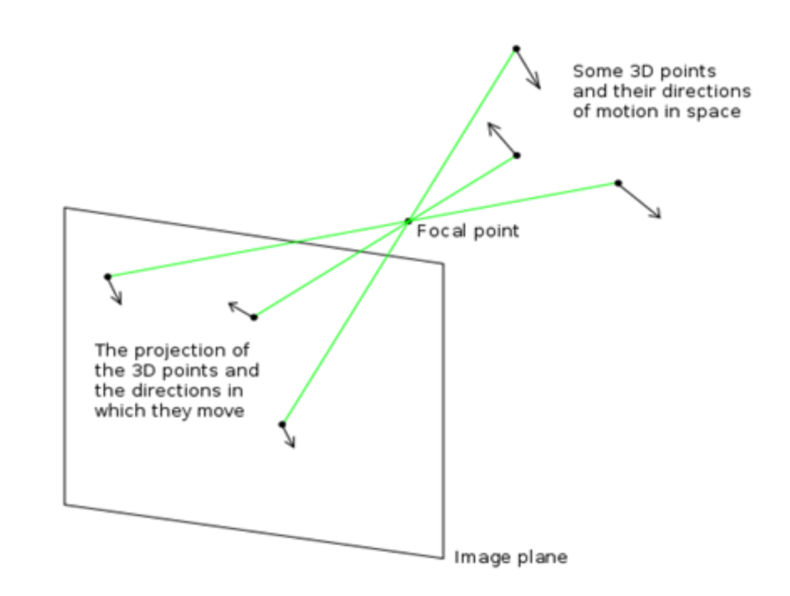
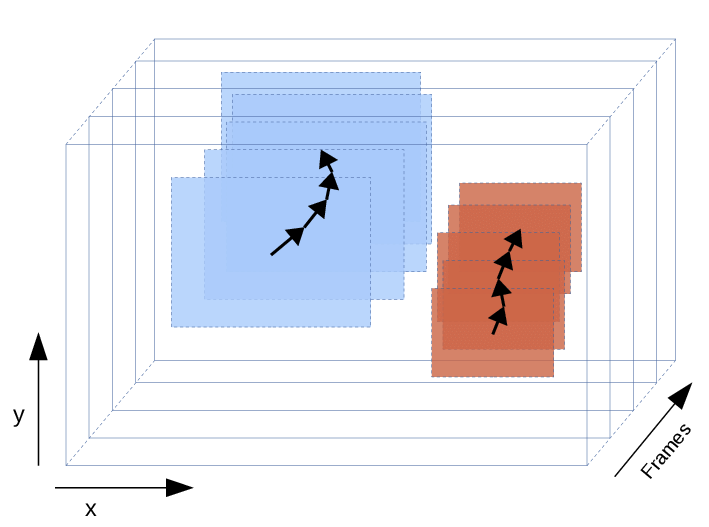
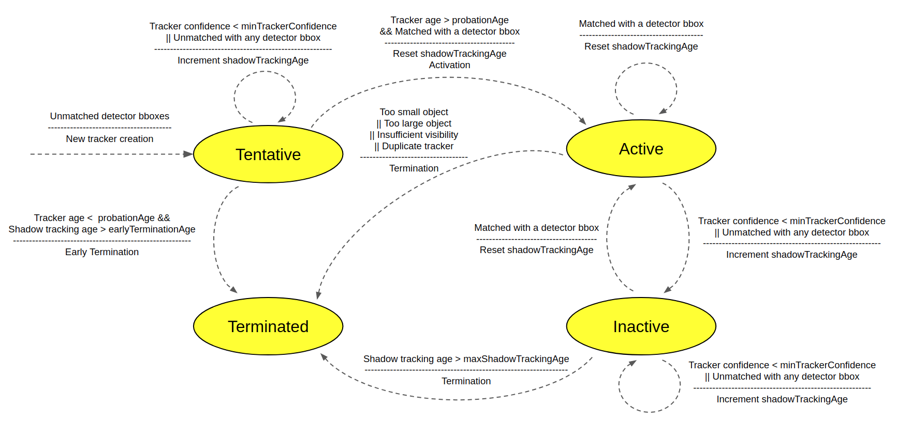

.. _deepstream_tracker_config:

DeepStream - Tracker Configurations
===================================

See `Gst-nvtracker <https://docs.nvidia.com/metropolis/deepstream/dev-guide/text/DS_plugin_gst-nvtracker.html>`_ for all configurable properties and comparison of trackers

KLT tracker
-----------

Base Assumptions for KLT:

	* Consistent light given intensity function :math:`I(x, y, t) = J(x', y', t + \tau)`
	* Time consistent, small between-motion difference (continuous frames)
	* Space consistency

IoU tracker
-----------

In case of using IoU tracker, a iou configuration text file (e.g. :code:`iou_config.txt`) is supplied as :code:`ll-config-file` in DeepStream app config file. The config file defines :code:`iou-threshold` to be adopted for tracking.

::

	[IOU_CONFIG]
	iou-threshold=0.6

NvDCF tracker
-------------

NvDCF tracker is an implementation of custom low-level library for trackers used in DeepStream.

* Similar to IoU tracker, a NvDCF configuration yml file (e.g. :code:`tracker.yml`) is supplied as :code:`ll-config-file` in DeepStream app config file. A sample :code:`tracker.yml` will look like this

::

	%YAML:1.0
	################################################################################
	# Copyright (c) 2020, NVIDIA CORPORATION. All rights reserved.
	#
	# Permission is hereby granted, free of charge, to any person obtaining a
	# copy of this software and associated documentation files (the "Software"),
	# to deal in the Software without restriction, including without limitation
	# the rights to use, copy, modify, merge, publish, distribute, sublicense,
	# and/or sell copies of the Software, and to permit persons to whom the
	# Software is furnished to do so, subject to the following conditions:
	#
	# The above copyright notice and this permission notice shall be included in
	# all copies or substantial portions of the Software.
	#
	# THE SOFTWARE IS PROVIDED "AS IS", WITHOUT WARRANTY OF ANY KIND, EXPRESS OR
	# IMPLIED, INCLUDING BUT NOT LIMITED TO THE WARRANTIES OF MERCHANTABILITY,
	# FITNESS FOR A PARTICULAR PURPOSE AND NONINFRINGEMENT.  IN NO EVENT SHALL
	# THE AUTHORS OR COPYRIGHT HOLDERS BE LIABLE FOR ANY CLAIM, DAMAGES OR OTHER
	# LIABILITY, WHETHER IN AN ACTION OF CONTRACT, TORT OR OTHERWISE, ARISING
	# FROM, OUT OF OR IN CONNECTION WITH THE SOFTWARE OR THE USE OR OTHER
	# DEALINGS IN THE SOFTWARE.
	################################################################################

	NvDCF:
	  # [General]
	  useUniqueID: 1    # Use 64-bit long Unique ID when assignining tracker ID. Default is [true]
	  maxTargetsPerStream: 99 # Max number of targets to track per stream. Recommended to set >10. Note: this value should account for the targets being tracked in shadow mode as well. Max value depends on the GPU memory capacity

	  # [Feature Extraction]
	  useColorNames: 1     # Use ColorNames feature
	  useHog: 0            # Use Histogram-of-Oriented-Gradient (HOG) feature
	  useHighPrecisionFeature: 0   # Use high-precision in feature extraction. Default is [true]

	  # [DCF]
	  filterLr: 0.15 # learning rate for DCF filter in exponential moving average. Valid Range: [0.0, 1.0]
	  filterChannelWeightsLr: 0.22 # learning rate for the channel weights among feature channels. Valid Range: [0.0, 1.0]
	  gaussianSigma: 0.75 # Standard deviation for Gaussian for desired response when creating DCF filter [pixels]
	  featureImgSizeLevel: 3 # Size of a feature image. Valid range: {1, 2, 3, 4, 5}, from the smallest to the largest
	  SearchRegionPaddingScale: 1 # Search region size. Determines how large the search region should be scaled from the target bbox.  Valid range: {1, 2, 3}, from the smallest to the largest

	  # [MOT] [False Alarm Handling]
	  maxShadowTrackingAge: 30  # Max length of shadow tracking (the shadow tracking age is incremented when (1) there's detector input yet no match or (2) tracker confidence is lower than minTrackerConfidence). Once reached, the tracker will be terminated.
	  probationAge: 3           # Once the tracker age (incremented at every frame) reaches this, the tracker is considered to be valid
	  earlyTerminationAge: 1    # Early termination age (in terms of shadow tracking age) during the probation period. If reached during the probation period, the tracker will be terminated prematurely.

	  # [Tracker Creation Policy] [Target Candidacy]
	  minDetectorConfidence: -1  # If the confidence of a detector bbox is lower than this, then it won't be considered for tracking
	  minTrackerConfidence: 0.7  # If the confidence of an object tracker is lower than this on the fly, then it will be tracked in shadow mode. Valid Range: [0.0, 1.0]
	  minTargetBboxSize: 10      # If the width or height of the bbox size gets smaller than this threshold, the target will be terminated.
	  minDetectorBboxVisibilityTobeTracked: 0.0  # If the detector-provided bbox's visibility (i.e., IOU with image) is lower than this, it won't be considered.
	  minVisibiilty4Tracking: 0.0  # If the visibility of the tracked object (i.e., IOU with image) is lower than this, it will be terminated immediately, assuming it is going out of scene.

	  # [Tracker Termination Policy]
	  targetDuplicateRunInterval: 5 # The interval in which the duplicate target detection removal is carried out. A Negative value indicates indefinite interval. Unit: [frames]
	  minIou4TargetDuplicate: 0.9 # If the IOU of two target bboxes are higher than this, the newer target tracker will be terminated.

	  # [Data Association] Matching method
	  useGlobalMatching: 0   # If true, enable a global matching algorithm (i.e., Hungarian method). Otherwise, a greedy algorithm wll be used.
	  usePersistentThreads: 0 # If true, create data association threads once and re-use them

	  # [Data Association] Thresholds in matching scores to be considered as a valid candidate for matching
	  minMatchingScore4Overall: 0.0   # Min total score
	  minMatchingScore4SizeSimilarity: 0.5    # Min bbox size similarity score
	  minMatchingScore4Iou: 0.1       # Min IOU score
	  minMatchingScore4VisualSimilarity: 0.2    # Min visual similarity score 

	  # [Data Association] Weights for each matching score term
	  matchingScoreWeight4VisualSimilarity: 0.8  # Weight for the visual similarity (in terms of correlation response ratio)
	  matchingScoreWeight4SizeSimilarity: 0.0    # Weight for the Size-similarity score
	  matchingScoreWeight4Iou: 0.1               # Weight for the IOU score
	  matchingScoreWeight4Age: 0.1               # Weight for the tracker age

	  # [State Estimator]
	  useTrackSmoothing: 1    # Use a state estimator
	  stateEstimatorType: 1   # The type of state estimator among { moving_avg:1, kalman_filter:2 }

	  # [State Estimator] [MovingAvgEstimator]
	  trackExponentialSmoothingLr_loc: 0.5       # Learning rate for new location
	  trackExponentialSmoothingLr_scale: 0.3     # Learning rate for new scale
	  trackExponentialSmoothingLr_velocity: 0.05  # Learning rate for new velocity

	  # [State Estimator] [Kalman Filter]
	  kfProcessNoiseVar4Loc: 0.1   # Process noise variance for location in Kalman filter
	  kfProcessNoiseVar4Scale: 0.04   # Process noise variance for scale in Kalman filter
	  kfProcessNoiseVar4Vel: 0.04   # Process noise variance for velocity in Kalman filter
	  kfMeasurementNoiseVar4Trk: 9   # Measurement noise variance for tracker's detection in Kalman filter
	  kfMeasurementNoiseVar4Det: 9   # Measurement noise variance for detector's detection in Kalman filter

	  # [Past-frame Data]
	  useBufferedOutput: 0   # Enable storing of past-frame data in a buffer and report it back

	  # [Instance-awareness]
	  useInstanceAwareness: 0 # Use instance-awareness for multi-object tracking
	  lambda_ia: 2            # Regularlization factor for each instance
	  maxInstanceNum_ia: 4    # The number of nearby object instances to use for instance-awareness

Key concepts for NvDCF Tracker:

* Maximum being-tracked objects: :code:`maxTargetsPerStream` is set for GPU memory allocation. If the number of being-tracked objects is larger then this property, further objects will not be tracked until memory resources released.

* Shadow mode: Set :code:`useBufferedOutput` as 1 to enable the tracker to store past frames (inactive being-tracked objects) (If you enable shadow mode, you must set *enable-past-frame* and *enable-batch-process* to 1 under *[tracker]* group in DeepStream app config). You may set :code:`maxTargetsPerStream` higher to store more objects in shadow mode to improve tracking based on previous frames (be aware of your GPU memory resources).

* Correlation Filter

* Search Region: This region is an area expanded from the diagonal of bounding box where the tracker expects to see the object in future frame(s). The size of the search region is::

	searchRegionWidth = w + SearchRegionPaddingScale*sqrt(w*h) # w - width of bbox
	searchRegionHeight = h + SearchRegionPaddingScale*sqrt(w*h) # h - height of bbox

* Feature extration: Once a search region is formed, the region is then cropped and scaled to predefined feature image size for feature extraction, and :code:`featureImgSizeLevel` is configured based on your interested feature image size. A lower :code:`featureImgSizeLevel` results in better GPU performance but lower accuracy, *vice versa*.

* Minimum detector confidence: Trackers to filter out tracking objects below :code:`minDetectorConfidence`.

* Late Activation: Initiation of tracker for target x, which must be activated in Active mode to be considered a valid targe in :code:`probationAge` (object detected with bbox) or :code:`earlyTerminationAge` (object not detected with bbox).

* Shadow Tracking

	* Active objects might become inactive (in shadow mode) if no data association is found from PGIE. Also, if the tracker confidence is lower than :code:`minTrackerConfidence`, an object will be put into inactive mode.
	* Inactive objects will become active if data association is found for them.
	* Inactive objects will be terminated if they have been inactive for a period defined by :code:`maxShadowTrackingAge`.
	* Inactive objects will be terminated if it falls out of the frame at certain threshold defined by :code:`minVisibiilty4Tracking`.

* State estimator

* Cross correlation

