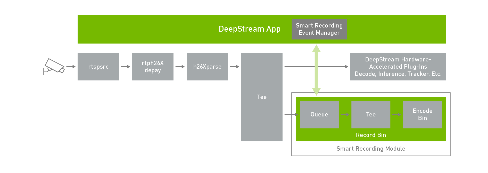

DeepStream - Smart Video Recording
==================================

Smart video recording (SVR) is an event-based recording that a portion of video is recorded in parallel to DeepStream pipeline based on objects of interests or specific rules for recording. In this documentation, we will go through 

	* Host Kafka server,
	* producing events to Kafka Cluster from AGX Xavier during DeepStream runtime, and
	* AGX Xavier consuming events from Kafka Cluster to trigger SVR.

*deepstream-test5* sample application will be used for demonstrating SVR. Edge AI device (AGX Xavier) is used for this demonstration. You may use other devices (e.g. Jetson devices) to follow the demonstration.

Prerequisites
-------------

	* Kafka (Download `here <https://www.apache.org/dyn/closer.cgi?path=/kafka/2.8.0/kafka_2.13-2.8.0.tgz>`_)
	* kafka-python==2.0.2

You may also refer to `Kafka Quickstart guide <https://kafka.apache.org/quickstart>`_ to get familiar with Kafka.

1. Create RTSP stream
---------------------

To start with, let's prepare a RTSP stream using DeepStream. If you don't have any RTSP cameras, you may pull DeepStream `demo container <https://github.com/spoonnvidia/ds-demo>`_ . After pulling the container, you might open the notebook :file:`deepstream-rtsp-out.ipynb` and create a RTSP source.

2. Host Kafka server
--------------------

Configure Kafka server (:file:`kafka_2.13-2.8.0/config/server.properties`):: 

	listeners=PLAINTEXT://127.0.0.1:29092, PLAINTEXT_HOST://<your-host-ip>:9092
	advertised.listeners=PLAINTEXT://127.0.0.1:29092, PLAINTEXT_HOST://<your-host-ip>:9092
	listener.security.protocol.map=PLAINTEXT:PLAINTEXT,PLAINTEXT_HOST:PLAINTEXT,SSL:SSL,SASL_PLAINTEXT:SASL_PLAINTEXT,SASL_SSL:SASL_SSL
	zookeeper.connect=<your-host-ip>:2181

To host Kafka server, we open first terminal::

	cd kafka_2.13-2.8.0
	bin/zookeeper-server-start.sh config/zookeeper.properties

Then, we open second terminal::

	cd kafka_2.13-2.8.0
	bin/kafka-server-start.sh config/server.properties

Open a third terminal, and create a *topic* (You may think of a topic as a YouTube Channel which others people can subscribe to)::

	cd kafka_2.13-2.8.0
	bin/kafka-topics.sh --create --topic <name> --bootstrap-server <host>:9092

You might check topic list of a Kafka server::

	bin/kafka-topics.sh --list --bootstrap-server <your-host-ip>:9092

Now, Kafka server is ready for AGX Xavier to produce events. Let's go back to AGX Xavier for next step.

3. Configure DeepStream application to produce events
-----------------------------------------------------

On AGX Xavier, we first find the deepstream-app-test5 directory and create the sample application::

	cd <deepstream-dir>/sources/apps/sample_apps/deepstream-test5
	export CUDA_VER=x.y 
	make

*If you are not sure which CUDA_VER you have, check */usr/local/**

Configure :code:`[source0]` and :code:`[sink1]` groups of DeepStream app config :file:`configs/test5_dec_infer-resnet_tracker_sgie_tiled_display_int8.txt` so that DeepStream is able to use RTSP source from step 1 and render events to your Kafka server::

	[source0]
	uri=rtsp://<your-host-ip>:8554/ds-test # rtsp address in step 1.

	[sink1]
	enable=1
	#Type - 1=FakeSink 2=EglSink 3=File 4=UDPSink 5=nvoverlaysink 6=MsgConvBroker
	type=6
	msg-conv-config=dstest5_msgconv_sample_config.txt
	#(0): PAYLOAD_DEEPSTREAM - Deepstream schema payload
	#(1): PAYLOAD_DEEPSTREAM_MINIMAL - Deepstream schema payload minimal
	#(256): PAYLOAD_RESERVED - Reserved type
	#(257): PAYLOAD_CUSTOM   - Custom schema payload
	msg-conv-payload-type=0
	msg-broker-proto-lib=/opt/nvidia/deepstream/deepstream-5.1/lib/libnvds_kafka_proto.so
	#Provide your msg-broker-conn-str here
	msg-broker-conn-str=<your-host-ip>;9092;<your-created-topic>
	topic=<your-created-topic>
	#Optional:
	#msg-broker-config=../../deepstream-test4/cfg_kafka.txt
	#new-api=0
	#(0) Use message adapter library api's
	#(1) Use new msgbroker library api's

4. Produce device-to-cloud event messages
-----------------------------------------

At this stage, our DeepStream application is ready to run and produce events containing bounding box coordinates to Kafka server::

	deepstream-test5-app -c test5_dec_infer-resnet_tracker_sgie_tiled_display_int8.txt -p 0

To consume the events, we write :file:`consumer.py`

.. code-block:: python

	# consumer.py
	import time
	from kafka import KafkaConsumer
	from json import loads
	import uuid 

	consumer = KafkaConsumer(
	    '<your-created-topic>',
	    bootstrap_servers='<your-host-ip>:9092',
	    auto_offset_reset='latest',
	    enable_auto_commit=True,
	    group_id=str(uuid.uuid1()),
	    value_deserializer=lambda x: loads(x.decode('utf-8'))
	)

	# do a dummy poll to retrieve some message
	consumer.poll()

	# go to end of the stream
	consumer.seek_to_end()

	for event in consumer:
	    event_data = event.value
	    print(event_data)

By executing this :file:`consumer.py` when AGX Xavier is *producing the events*, we now can read the events produced from AGX Xavier::

	python3 consumer.py

::

	{'messageid': 'c332e7f2-e4a1-4913-94ec-4573a134e2f8', 'mdsversion': '1.0', '@timestamp': '2021-07-28T17:53:19.339Z', 'place': {'id': '0', 'name': 'HWY_20_AND_LOCUST__EBA', 'type': 'intersection/road', 'location': {'lat': 30.32, 'lon': -40.55, 'alt': 100.0}, 'entrance': {'name': 'C_127_158', 'lane': 'Lane 1', 'level': 'P1', 'coordinate': {'x': 1.0, 'y': 2.0, 'z': 3.0}}}, 'sensor': {'id': 'HWY_20_AND_LOCUST__EBA__4_11_2018_4_59_59_508_AM_UTC-07_00', 'type': 'Camera', 'description': 'Aisle Camera', 'location': {'lat': 45.293701447, 'lon': -75.8303914499, 'alt': 48.1557479338}, 'coordinate': {'x': 5.2, 'y': 10.1, 'z': 11.2}}, 'analyticsModule': {'id': 'XYZ_1', 'description': 'Vehicle Detection and License Plate Recognition', 'source': 'OpenALR', 'version': '1.0'}, 'object': {'id': '13103', 'speed': 0.0, 'direction': 0.0, 'orientation': 0.0, 'Person': {}, 'bbox': {'topleftx': 251, 'toplefty': 315, 'bottomrightx': 317, 'bottomrighty': 512}, 'location': {'lat': 0.0, 'lon': 0.0, 'alt': 0.0}, 'coordinate': {'x': 0.0, 'y': 0.0, 'z': 0.0}}, 'event': {'id': '332e71a4-0281-40fa-be86-d91f71095594', 'type': 'entry'}, 'videoPath': ''}
	{'messageid': 'ffc6cc6b-613e-4c70-9b5d-315c2bbca1d1', 'mdsversion': '1.0', '@timestamp': '2021-07-28T17:53:19.372Z', 'place': {'id': '0', 'name': 'HWY_20_AND_LOCUST__EBA', 'type': 'intersection/road', 'location': {'lat': 30.32, 'lon': -40.55, 'alt': 100.0}, 'entrance': {'name': 'C_127_158', 'lane': 'Lane 1', 'level': 'P1', 'coordinate': {'x': 1.0, 'y': 2.0, 'z': 3.0}}}, 'sensor': {'id': 'HWY_20_AND_LOCUST__EBA__4_11_2018_4_59_59_508_AM_UTC-07_00', 'type': 'Camera', 'description': 'Aisle Camera', 'location': {'lat': 45.293701447, 'lon': -75.8303914499, 'alt': 48.1557479338}, 'coordinate': {'x': 5.2, 'y': 10.1, 'z': 11.2}}, 'analyticsModule': {'id': 'XYZ_1', 'description': 'Vehicle Detection and License Plate Recognition', 'source': 'OpenALR', 'version': '1.0'}, 'object': {'id': '13103', 'speed': 0.0, 'direction': 0.0, 'orientation': 0.0, 'Person': {}, 'bbox': {'topleftx': 256, 'toplefty': 315, 'bottomrightx': 317, 'bottomrighty': 505}, 'location': {'lat': 0.0, 'lon': 0.0, 'alt': 0.0}, 'coordinate': {'x': 0.0, 'y': 0.0, 'z': 0.0}}, 'event': {'id': '8fe35b07-71be-4369-bd21-27d0711cdcad', 'type': 'entry'}, 'videoPath': ''}
	{'messageid': 'ca1d5d40-9882-41a5-95c9-a58b21b38aa3', 'mdsversion': '1.0', '@timestamp': '2021-07-28T17:53:19.472Z', 'place': {'id': '0', 'name': 'HWY_20_AND_LOCUST__EBA', 'type': 'intersection/road', 'location': {'lat': 30.32, 'lon': -40.55, 'alt': 100.0}, 'entrance': {'name': 'C_127_158', 'lane': 'Lane 1', 'level': 'P1', 'coordinate': {'x': 1.0, 'y': 2.0, 'z': 3.0}}}, 'sensor': {'id': 'HWY_20_AND_LOCUST__EBA__4_11_2018_4_59_59_508_AM_UTC-07_00', 'type': 'Camera', 'description': 'Aisle Camera', 'location': {'lat': 45.293701447, 'lon': -75.8303914499, 'alt': 48.1557479338}, 'coordinate': {'x': 5.2, 'y': 10.1, 'z': 11.2}}, 'analyticsModule': {'id': 'XYZ_1', 'description': 'Vehicle Detection and License Plate Recognition', 'source': 'OpenALR', 'version': '1.0'}, 'object': {'id': '13104', 'speed': 0.0, 'direction': 0.0, 'orientation': 0.0, 'Car': {}, 'bbox': {'topleftx': 0, 'toplefty': 507, 'bottomrightx': 64, 'bottomrighty': 585}, 'location': {'lat': 0.0, 'lon': 0.0, 'alt': 0.0}, 'coordinate': {'x': 0.0, 'y': 0.0, 'z': 0.0}}, 'event': {'id': 'cfa82777-5b54-4e01-a19b-e0ee73711917', 'type': 'entry'}, 'videoPath': ''}
	{'messageid': 'e016b4bc-916e-4cb1-8dd0-143e160ccf18', 'mdsversion': '1.0', '@timestamp': '2021-07-28T17:53:19.506Z', 'place': {'id': '0', 'name': 'HWY_20_AND_LOCUST__EBA', 'type': 'intersection/road', 'location': {'lat': 30.32, 'lon': -40.55, 'alt': 100.0}, 'entrance': {'name': 'C_127_158', 'lane': 'Lane 1', 'level': 'P1', 'coordinate': {'x': 1.0, 'y': 2.0, 'z': 3.0}}}, 'sensor': {'id': 'HWY_20_AND_LOCUST__EBA__4_11_2018_4_59_59_508_AM_UTC-07_00', 'type': 'Camera', 'description': 'Aisle Camera', 'location': {'lat': 45.293701447, 'lon': -75.8303914499, 'alt': 48.1557479338}, 'coordinate': {'x': 5.2, 'y': 10.1, 'z': 11.2}}, 'analyticsModule': {'id': 'XYZ_1', 'description': 'Vehicle Detection and License Plate Recognition', 'source': 'OpenALR', 'version': '1.0'}, 'object': {'id': '13105', 'speed': 0.0, 'direction': 0.0, 'orientation': 0.0, 'Car': {}, 'bbox': {'topleftx': 0, 'toplefty': 507, 'bottomrightx': 55, 'bottomrighty': 577}, 'location': {'lat': 0.0, 'lon': 0.0, 'alt': 0.0}, 'coordinate': {'x': 0.0, 'y': 0.0, 'z': 0.0}}, 'event': {'id': 'a4b65154-31d8-4151-9fcd-fc76c7316362', 'type': 'entry'}, 'videoPath': ''}
	{'messageid': '3fe50d08-2ca0-49e0-b09d-c4776f4ff246', 'mdsversion': '1.0', '@timestamp': '2021-07-28T17:53:19.940Z', 'place': {'id': '0', 'name': 'HWY_20_AND_LOCUST__EBA', 'type': 'intersection/road', 'location': {'lat': 30.32, 'lon': -40.55, 'alt': 100.0}, 'entrance': {'name': 'C_127_158', 'lane': 'Lane 1', 'level': 'P1', 'coordinate': {'x': 1.0, 'y': 2.0, 'z': 3.0}}}, 'sensor': {'id': 'HWY_20_AND_LOCUST__EBA__4_11_2018_4_59_59_508_AM_UTC-07_00', 'type': 'Camera', 'description': 'Aisle Camera', 'location': {'lat': 45.293701447, 'lon': -75.8303914499, 'alt': 48.1557479338}, 'coordinate': {'x': 5.2, 'y': 10.1, 'z': 11.2}}, 'analyticsModule': {'id': 'XYZ_1', 'description': 'Vehicle Detection and License Plate Recognition', 'source': 'OpenALR', 'version': '1.0'}, 'object': {'id': '13106', 'speed': 0.0, 'direction': 0.0, 'orientation': 0.0, 'Person': {}, 'bbox': {'topleftx': 221, 'toplefty': 285, 'bottomrightx': 305, 'bottomrighty': 527}, 'location': {'lat': 0.0, 'lon': 0.0, 'alt': 0.0}, 'coordinate': {'x': 0.0, 'y': 0.0, 'z': 0.0}}, 'event': {'id': '25d88f37-9d82-461d-b951-4b54e815a026', 'type': 'entry'}, 'videoPath': ''}
	{'messageid': 'c4792a90-c0d0-4957-8850-fadc6f3b7de1', 'mdsversion': '1.0', '@timestamp': '2021-07-28T17:53:19.973Z', 'place': {'id': '0', 'name': 'HWY_20_AND_LOCUST__EBA', 'type': 'intersection/road', 'location': {'lat': 30.32, 'lon': -40.55, 'alt': 100.0}, 'entrance': {'name': 'C_127_158', 'lane': 'Lane 1', 'level': 'P1', 'coordinate': {'x': 1.0, 'y': 2.0, 'z': 3.0}}}, 'sensor': {'id': 'HWY_20_AND_LOCUST__EBA__4_11_2018_4_59_59_508_AM_UTC-07_00', 'type': 'Camera', 'description': 'Aisle Camera', 'location': {'lat': 45.293701447, 'lon': -75.8303914499, 'alt': 48.1557479338}, 'coordinate': {'x': 5.2, 'y': 10.1, 'z': 11.2}}, 'analyticsModule': {'id': 'XYZ_1', 'description': 'Vehicle Detection and License Plate Recognition', 'source': 'OpenALR', 'version': '1.0'}, 'object': {'id': '13106', 'speed': 0.0, 'direction': 0.0, 'orientation': 0.0, 'Person': {}, 'bbox': {'topleftx': 224, 'toplefty': 295, 'bottomrightx': 305, 'bottomrighty': 525}, 'location': {'lat': 0.0, 'lon': 0.0, 'alt': 0.0}, 'coordinate': {'x': 0.0, 'y': 0.0, 'z': 0.0}}, 'event': {'id': '242e4abc-ea47-4962-8f83-df1087e19746', 'type': 'entry'}, 'videoPath': ''}

5. Produce cloud-to-device event messages
-----------------------------------------

Note that messages we received earlier is device-to-cloud messages produced from AGX Xavier. To trigger SVR, AGX Xavier expects to receive formatted JSON messages from Kafka server::

	{
		command: string   // <start-recording / stop-recording>
		start: string     // "2020-05-18T20:02:00.051Z"
		end: string       // "2020-05-18T20:02:02.851Z",
		sensor: {
		id: string
		}
	}

To implement custom logic to produce the messages, we write :file:`trigger-svr.py`

.. code-block:: python

	import time
	import datetime
	from kafka import KafkaConsumer, KafkaProducer
	from json import loads, dumps
	import uuid 
	import ast

	consumer = KafkaConsumer(
	    '<your-created-topic>',
	    bootstrap_servers='<your-host-ip>:9092',
	    auto_offset_reset='latest',
	    enable_auto_commit=True,
	    group_id=str(uuid.uuid1()),
	    value_deserializer=lambda x: loads(x.decode('utf-8'))
	)

	producer = KafkaProducer(
	    bootstrap_servers='<your-host-ip>:9092',
	    value_serializer=lambda x: dumps(x).encode('utf-8')
	)

	# do a dummy poll to retrieve some message
	consumer.poll()

	# go to end of the stream
	consumer.seek_to_end()

	for event in consumer:

	    event_data = event.value

	    dt_now = datetime.datetime.now()
	    end_time = dt_now + datetime.timedelta(seconds=3)

	    time_start = dt_now.strftime('%Y-%m-%dT%H:%M:%S.%f')[:-3]+"Z"
	    time_end = end_time.strftime('%Y-%m-%dT%H:%M:%S.%f')[:-3]+"Z"

	    # send formatted string to 
	    data = {'command': 'start-recording',
	            'start': time_start,
	            'end': time_end,
	            'sensor': {
	                'id': "HWY_20_AND_LOCUST__EBA__4_11_2018_4_59_59_508_AM_UTC-07_00"
	            }
	            }

	    producer.send('<topic-for-svr>', value=data)
	    print(event_data)

By executing this :file:`trigger-svr.py` when *AGX is producing the events*, we now can not only consume the messages from AGX Xavier but also produce JSON messages to :code:`<topic-for-svr>` in Kafka server which will be subscribed by AGX Xavier to trigger SVR.

.. code-block:: python

	python3 trigger-svr.py

Note that the formatted messages were sent to :code:`<topic-for-svr>`, let's rewrite our :file:`consumer.py` to inspect the formatted messages from this topic.

.. code-block:: python

	# consumer.py
	import time
	from kafka import KafkaConsumer
	from json import loads
	import uuid 

	consumer = KafkaConsumer(
	    '<topic-for-svr>',
	    bootstrap_servers='<your-host-ip>:9092',
	    auto_offset_reset='latest',
	    enable_auto_commit=True,
	    group_id=str(uuid.uuid1()),
	    value_deserializer=lambda x: loads(x.decode('utf-8'))
	)

	# do a dummy poll to retrieve some message
	consumer.poll()

	# go to end of the stream
	consumer.seek_to_end()

	for event in consumer:
	    event_data = event.value
	    print(event_data)

::

	{'command': 'start-recording', 'start': '2021-07-28T17:53:18.805Z', 'end': '2021-07-28T17:53:21.805Z', 'sensor': {'id': 'HWY_20_AND_LOCUST__EBA__4_11_2018_4_59_59_508_AM_UTC-07_00'}}
	{'command': 'start-recording', 'start': '2021-07-28T17:53:18.838Z', 'end': '2021-07-28T17:53:21.838Z', 'sensor': {'id': 'HWY_20_AND_LOCUST__EBA__4_11_2018_4_59_59_508_AM_UTC-07_00'}}
	{'command': 'start-recording', 'start': '2021-07-28T17:53:18.872Z', 'end': '2021-07-28T17:53:21.872Z', 'sensor': {'id': 'HWY_20_AND_LOCUST__EBA__4_11_2018_4_59_59_508_AM_UTC-07_00'}}
	{'command': 'start-recording', 'start': '2021-07-28T17:53:18.872Z', 'end': '2021-07-28T17:53:21.872Z', 'sensor': {'id': 'HWY_20_AND_LOCUST__EBA__4_11_2018_4_59_59_508_AM_UTC-07_00'}}
	{'command': 'start-recording', 'start': '2021-07-28T17:53:18.872Z', 'end': '2021-07-28T17:53:21.872Z', 'sensor': {'id': 'HWY_20_AND_LOCUST__EBA__4_11_2018_4_59_59_508_AM_UTC-07_00'}}
	{'command': 'start-recording', 'start': '2021-07-28T17:53:18.905Z', 'end': '2021-07-28T17:53:21.905Z', 'sensor': {'id': 'HWY_20_AND_LOCUST__EBA__4_11_2018_4_59_59_508_AM_UTC-07_00'}}

6. Consume event messages to trigger SVR
----------------------------------------

Before SVR is being triggered, configure :code:`[source0	]` and :code:`[message-consumer0]` groups in DeepStream config (:file:`test5_dec_infer-resnet_tracker_sgie_tiled_display_int8.txt`)::

	[source0]
	enable=1
	#Type - 1=CameraV4L2 2=URI 3=MultiURI 4=RTSP
	type=4
	uri=rtsp://<your-host-ip>:8554/ds-test # rtsp address in step 1
	num-sources=1
	gpu-id=0
	nvbuf-memory-type=0
	# smart record specific fields, valid only for source type=4
	# 0 = disable, 1 = through cloud events, 2 = through cloud + local events
	smart-record=1
	# 0 = mp4, 1 = mkv
	smart-rec-container=0
	#smart-rec-file-prefix
	smart-rec-dir-path=/path/to/your/dir
	# video cache size in seconds
	#smart-rec-video-cache
	# default duration of recording in seconds.
	#smart-rec-default-duration
	# duration of recording in seconds.
	# this will override default value.
	#smart-rec-duration
	# seconds before the current time to start recording.
	#smart-rec-start-time
	# value in seconds to dump video stream.
	#smart-rec-interval

	[message-consumer0]
	enable=1
	proto-lib=/opt/nvidia/deepstream/deepstream-5.1/lib/libnvds_kafka_proto.so
	conn-str=<your-host-ip>;9092
	config-file=../../deepstream-test4/cfg_kafka.txt
	subscribe-topic-list=<topic-for-svr>
	# Use this option if message has sensor name as id instead of index (0,1,2 etc.).
	sensor-list-file=dstest5_msgconv_sample_config.txt

Once the app config file is ready, run DeepStream::

	deepstream-test5-app -c test5_dec_infer-resnet_tracker_sgie_tiled_display_int8.txt -p 0

Finally, you are able to see recorded videos in your :file:`[smart-rec-dir-path]` under :code:`[source0]` group of the app config file.

