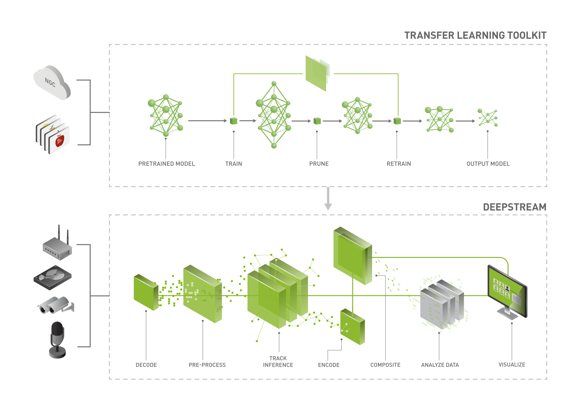

Transfer Learning Toolkit - Getting Started
===========================================

Transfer Learning Toolkit (TLT) is a tool to enable training a pretrained model with custom dataset and enable accelerated deployment of inference engines into DeepStream pipeline.

Prerequisites
-------------

Both TLT2 and TLT3 can be used, which is up to your preference.

TLT2:
	1. Register NGC API Key at https://ngc.nvidia.com/

	2. Log in docker with NGC API Key::

		docker login nvcr.io

	3. Pull TLT2 image::

		docker pull nvcr.io/nvidia/tlt-streamanalytics:v2.0_py3

	4. Create TLT2 container::

		docker run -it --network=host --rm --gpus all nvcr.io/nvidia/tlt-streamanalytics:v2.0_py3 /bin/bash

	5. Host jupyter server::

		jupyter notebook --ip 0.0.0.0 --port 8888 --allow-root

TLT3:
	1. Install python packages *virtualenv* and *virtualenvwrapper*::

		sudo pip3 install virtualenv virtualenvwrapper
		mkdir ~/.virtualenvs 

	2. Set up virtualenv by configuring :file:`~/.bashrc`::

		export VIRTUALENVWRAPPER_PYTHON=$(which python3)
		export WORKON_HOME=$HOME/.virtualenvs
		source /usr/local/bin/virtualenvwrapper.sh

	3. Create virtual environment::

		mkvirtualenv <your-virtual-environment>

	4. Install Jupyter notebook and dependencies::

		workon <your-virtual-environment>
		pip3 install jupyter
		pip3 install nvidia-pyindex
		pip3 install nvidia-tlt
		pip3 install tqdm
		pip3 install matplotlib==3.3.3

	5. Register NGC API Key at https://ngc.nvidia.com/

	6. Log in docker with NGC API Key::

		docker login nvcr.io

	7. Install sample notebooks::

		wget --content-disposition https://api.ngc.nvidia.com/v2/resources/nvidia/tlt_cv_samples/versions/v1.1.0/zip -O path/to/your/tlt_cv_samples_v1.1.0.zip

	8. Unzip the sample notebooks::

		unzip path/to/your/tlt_cv_samples_v1.1.0.zip -d path/to/your/<tlt-experiment-dir>

	9. Host jupyter server::

		cd path/to/your/<tlt-experiment-dir>
		jupyter notebook --ip 0.0.0.0 --port 8888 --allow-root

Sample TLT experiments
----------------------
Enter the jupyter server, select a sample TLT experiment, and follow the notebook to start training pretrained models with your own datasets.

Sample TLT pretrianed models in DeepStream
------------------------------------------

There are several tlt-DeepStream applications ready when DeepStream is installed, and they are located at :file:`/opt/nvidia/deepstream/deepstream-5.1/samples/configs/tlt_pretrained_models`

The usage for the models is easy, simply run with prepared DeepStream config files::

	cd /opt/nvidia/deepstream/deepstream-5.1/samples/configs/tlt_pretrained_models
	deepstream-app -c <deepstream_app_source1*>

For example::

	deepstream-app -c deepstream_app_source1_trafficcamnet.txt

The inference config file for DeepStream can be found under the same directory.
